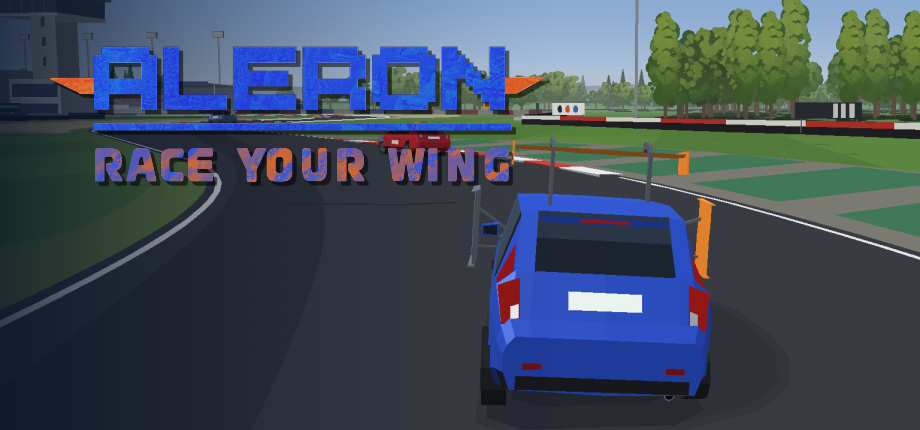
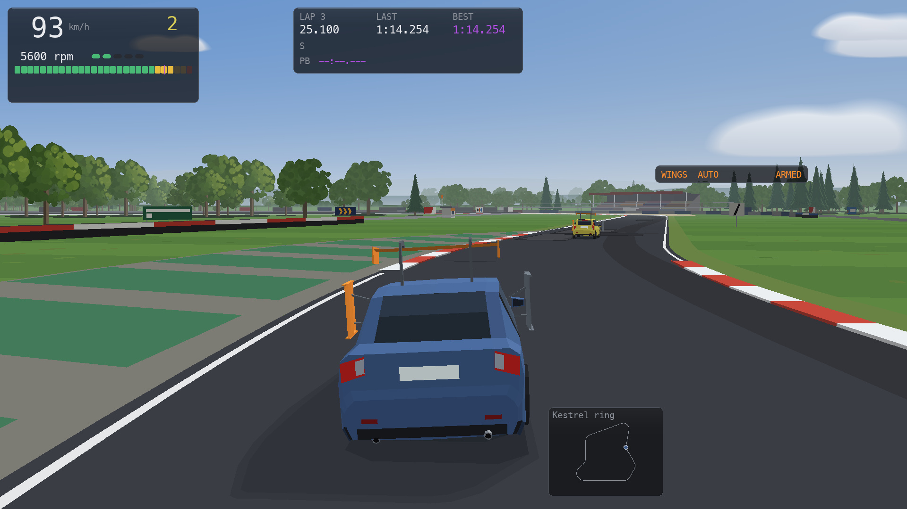
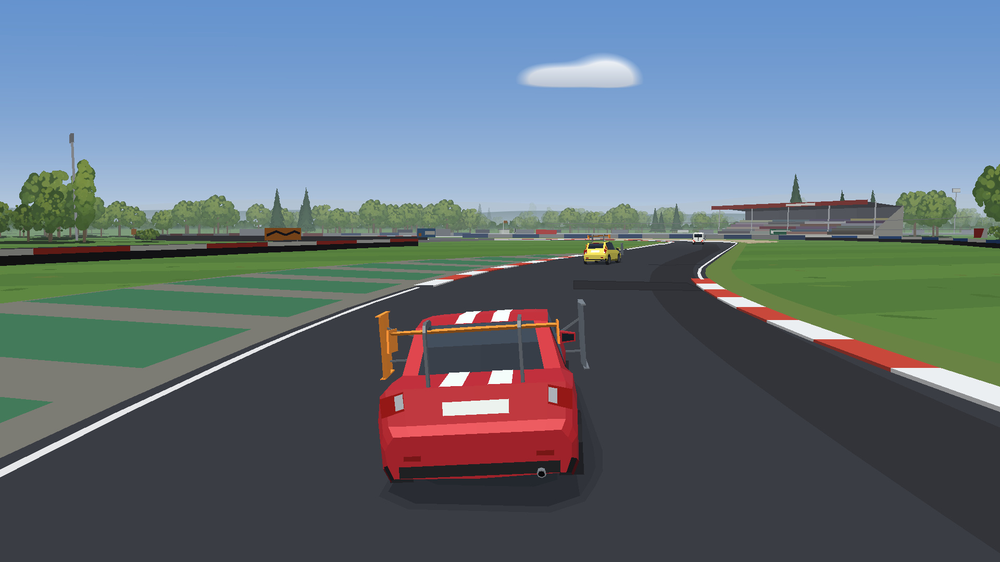
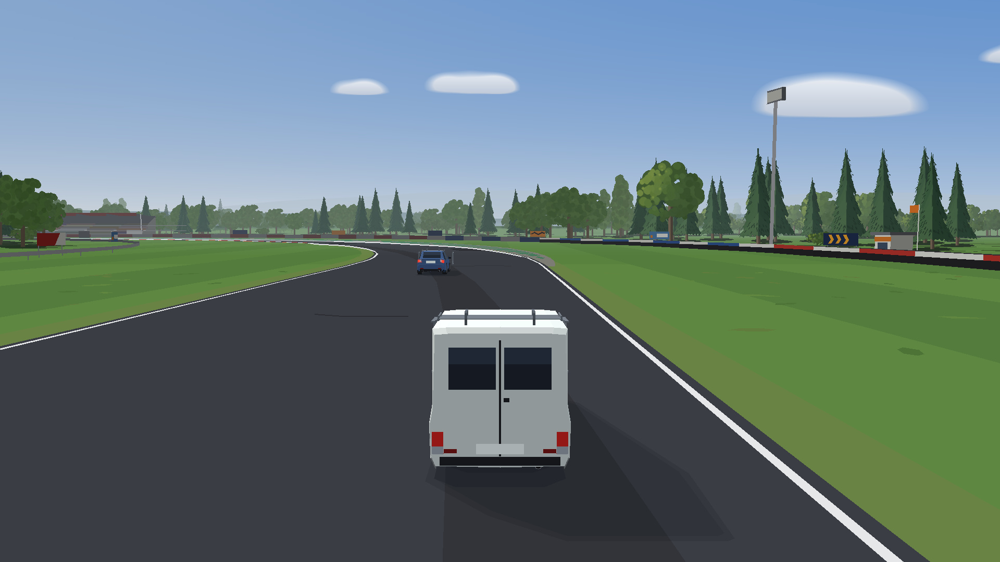

<p align="center">
  
</p>

# Alerón: Race Your Wing

**Design the wings, then drive them.** A physics-first time-attack racer where the lap is
won in the garage: shape movable side and top wings with a real aerodynamic optimiser,
bolt them on, and race the clock, your ghosts and bots you trained yourself.

<p align="center">
  
  
  
</p>

> **Status: Steam release in preparation** (build 0.9.0). Playable from source today.

### What it is

- **Wing design with a real optimiser.** The garage's WingLab designs side (flank) wings and a
  top wing in 3-D within each car's span limits, running AeroBO, my own wing-design engine:
  vortex-lattice aerodynamics, the UIUC airfoil library (2,174 sections), genetic (pymoo) and
  Bayesian (BoTorch) optimisers.
- **A vehicle simulation first.** Two-track model at a fixed 1 kHz step: load transfer, roll,
  a Pacejka Magic Formula 6.2 combined-slip tyre read from a TNO `.tir` file, engine, clutch,
  gearbox, differential, brakes, ABS and traction control, and wet patches that change the grip mid-lap.
- **Validated against analysis.** The simulator is held to a closed-form quasi-steady-state
  (QSS) analysis of the same car: corner speed within 0.7 %, peak lateral acceleration within
  0.9 %, top speed within 0.04 % ([table](#what-it-is-held-to)); 82/82 acceptance checks pass.
- **Something to chase.** Author, gold, silver and bronze medals per circuit and car, top-five laps
  with ghosts and a live delta, eight challenges (braking, skidpad, air brake, laps) and
  local leaderboards per map, car and wing mode.
- **Bots that learn.** Breed a swarm of driving agents from your own lap (a small neural policy
  evolved by a genetic algorithm across worker processes), then race the best of them.
- **Four fictional cars, eight maps.** Aurel Civetta 1.2 (FWD hatchback), Halcón RS18 (1970s RWD
  rally car), Nordwerk N540 (V8 RWD saloon), Rivière Courier 1.4 (FWD van), each built from
  published specs, with estimates marked as such. Five circuits plus an open proving
  ground, a skidpad and a dragstrip.
- **Keyboard or gamepad** (PlayStation and Xbox layouts via SDL), mouse in the menus; manual,
  clutch or automatic gearbox; driving and wing-design tutorials.

### Engineering highlights

- [`drive/tyre.py`](drive/tyre.py): MF6.2 evaluated from the same tyre data the QSS analysis was
  distilled from; swapping it into the analysis moves its corner speed by less than 0.005 %.
- [`drive/vehicle.py`](drive/vehicle.py): equations of motion, aero and wings, ABS/TC, and a
  documented integrator order (the reversed order diverges at 3 m/s at any step under 8 ms).
- [`drive/powertrain.py`](drive/powertrain.py): each engine's torque curve is a shape-preserving PCHIP
  through its published torque and power figures, cross-checked against the top-speed power balance.
- [`drive/validate.py`](drive/validate.py): the acceptance suite. HARD checks (signs, identities,
  conservation laws) fail the run; SOFT calibration bands are reported. 82/82 pass in ~2 min.
- [`aerobo/`](aerobo/): AeroBO vendored unmodified, with a content hash the test suite checks.
- [`drive/ml/`](drive/ml/): evolution-strategy and genetic-algorithm bots in plain numpy. They train at a
  2 ms step and every reported number is re-measured at 1 ms; the physics never imports them.
- [`drive/render.py`](drive/render.py): software renderer on pygame + numpy, no OpenGL. It draws a
  top-down view and a 3-D chase camera with vectorised projection and clipping, built around
  per-frame costs measured on the target machine.
- [`drive/audio.py`](drive/audio.py): engine, tyre and wind sound synthesised in numpy from
  the sim state. There are no sample files.
- [`packaging/`](packaging/) + [CI](.github/workflows/steam-build.yml): PyInstaller builds for
  Windows, macOS (Apple silicon and Intel) and Linux, each smoke-tested on an empty save folder.

### Play it

```
python3 -m pip install -r requirements.txt   # Python 3.11+; torch/botorch/gpytorch optional, see Install
python3 launch_game.py
```

Arrow keys drive, `G` changes the wing mode, `BACKSPACE` opens the garage and `ESC` opens
the menu, whose *Controls* page lists every key and pad button. Packaged builds will be
published on this repository's GitHub Releases page.

**Tech stack:** Python, NumPy, SciPy, pygame (SDL2), pymoo, optional PyTorch/BoTorch/GPyTorch,
PyInstaller, GitHub Actions. No game engine and no OpenGL: the 3-D is drawn in software.

The project began as an engineering study (is a deployable flank wing worth it on a small
hatchback?) and the game grew out of the simulator built to answer it. The study and the
simulator are documented below.

---

## Developer documentation: carsim, the deployable flank-wing study

Two halves that answer two different questions about the same car and the same
device, and are held to each other numerically.

**The analysis** (repo root) asks *is the device worth it*, in closed form and at
quasi-steady equilibrium.

**The simulator** (`drive/`) asks *what does it do in the time domain*, with the
same parameters, the same tyre and the same load-transfer algebra — and you can
drive it.

---

## Install

```
python3 -m pip install -r requirements.txt       # numpy, scipy, pygame + AeroBO's
```

The simulator needs numpy, scipy and pygame. The garage's wing designer is
**AeroBO** (`aerobo/`, vendored: nothing to install beyond its
requirements): pymoo, and for its Bayesian optimisers torch, botorch and
gpytorch -- optional (PyTorch has no wheel for Intel Macs or macOS 13 and
older; without it the designer says so and offers AeroBO's optimisers that
need none). XFOIL (optional, for AeroBO's section polars) is found as
`CARSIM_XFOIL`, then on the `PATH`, then at `/opt/homebrew/bin`,
`/usr/local/bin` or `/usr/bin`, and handed to AeroBO (`AEROBO_XFOIL_BIN`,
unless you set it yourself); without it the section library is screened at
AeroBO's cached library point and the section's shape search is refused.
AeroBO's runtime cache is `aerobo/results/` (gitignored).

## Drive it

```
python3 -m drive.drive                          # last map + settings, keyboard or pad
python3 -m drive.drive --track open             # the open proving ground
python3 -m drive.drive --track skidpad --radius 100
python3 -m drive.drive --track dragstrip
python3 -m drive.drive --gearbox manual         # or: auto | clutch
python3 -m drive.drive --engine sport           # 2x the torque (default: stock, each car its own)
python3 -m drive.drive --sound off              # or: low | mid | high
python3 -m drive.drive --wing plate --wet all   # sealed plate, wet
python3 -m drive.drive --car rally              # or: corsa | 540i | express
python3 -m drive.drive --ballast 200 --ballast-at boot
python3 -m drive.drive --camera chase           # the 3D view from behind
python3 -m drive.drive --garage                 # start in the 3D garage
python3 -m drive.drive --ml-drive drive/ml/checkpoints/arena_plate.json
python3 -m drive.drive --race best              # race the newest swarm checkpoint in the car it was bred in
python3 -m drive.drive --swarm 32 --swarm-seed latest   # a learning swarm, bred from your lap
python3 -m drive.drive --swarm 32 --swarm-car rally --swarm-fast --swarm-save never   # in a stock rally Escort, unwatched, unsaved
```

**The title screen.** A launch opens on it: **ALERÓN** — *Race Your Wing* — over a live scene —
a random circuit with one to five cars, never two of one kind, lapping on
their reference laps (the author laps the medals come from), each in its own
body and paint, and a chase camera that cuts from car to car every 10 s.
*Drive* is your car on your map, exactly as before (the first launch still
offers the tutorial, a timed map still opens on TIME TRIAL); *Challenges*,
*Leaderboards*, *Tutorial* and *Settings* start a session opened on that page (`ESC` there is
the pause menu); *Garage* opens the garage; *Quit* quits. `↑` `↓` / d-pad and
`ENTER` / `✕`, or the mouse; `ESC` quits and `BACKSPACE` is the garage, as
everywhere. A right click, `○` or `OPTIONS` only moves to *Quit* (then `ENTER`
/ `✕` quits): a stray click never closes the game. The bottom line says which car, map and build *Drive* starts
with. A launch that says what it is for — `--garage`, `--race`, `--seed-lap`,
`--ml-drive`, a swarm, a script, `--render offscreen`, `--headless` — skips
it. With no reference lap to replay, or on a machine too slow for the scene,
the background is a slowly panned panorama.

| key | | key | |
|---|---|---|---|
| `↑` `↓` | throttle / brake | `F` | wings armed on / off |
| `←` `→` | steer | `G` / `SHIFT+G` | wing mode, next / back: auto / air brake / top / top fixed / top fix+side / left / right |
| `LSHIFT` | fine (half rates, 50% pedal) | `T` | wet toggle |
| `Z` | clutch | `R` / `SHIFT+R` | back to the last sector line / restart the lap |
| `SPACE` | handbrake | `P` / `O` | pause / single step |
| `E` `Q` | shift up / down | `[` `]` | slow-mo 0.25x / 1x |
| `S` | starter | `C` | camera |
| `H` `V` `B` `N` `X` | HUD / force arrows / g-g / skid / clear | `-` `=` `0` | zoom |
| `M` `L` | telemetry marker / record | `TAB` | next map |
| `K` | arm a seed lap for the swarm (named and saved at the line) | `J` | ghosts on / off (time trial; a pad: the TIME TRIAL page's *Ghosts* row) |
| `BACKSPACE` | garage (3D panel editor) | `ESC` | pause menu / settings |

`ESC` (or `OPTIONS` on the pad) pauses and opens the menu: the controls of
the device you are using on screen, plus *Resume*, *Settings*, **Controls**
(the DualSense drawn with what every button does, and every key), *Time trial*
(on a map with
a lap), *Back to the last sector line (R)*, *Restart the lap (SHIFT+R)*, *Garage*,
*Deploy swarm*, *Race vs bot*, *Tutorial*, *Challenges*, *Main menu* (back to
the title) and *Quit to desktop*, which asks for a second `ENTER` (task 45).
During a challenge the page is shorter: *Resume*, *Retry*, *This challenge*,
*Challenges*, *Settings*, *Controls*, *Main menu*, *Quit to desktop*. `↑` `↓` / d-pad move, `←` `→` / d-pad
change a value on the settings page, `ENTER` / `✕`
select, `ESC` / `○` / `OPTIONS` resume; `R`, `SHIFT+R` and `BACKSPACE` work as
hotkeys inside it. Every menu page also takes the **mouse**: point at a row,
click it to run it, the wheel moves the cursor, a right click goes back. The car does not move and the pad does not rumble while it
is up. `P` is still the plain pause for `O` single-stepping.

`H` cycles the HUD: **minimal** (the default race HUD: speed, gear, timing,
minimap, a wing chip when wings are fitted), then **full** (the engineering
panels: loads, state, aero, pedals, g-g), then off, and back; Settings > HUD
has the same three. `V` shows the green and blue **force arrows**, off by
default (`runs/settings.json` `vectors`). The HUD level, the arrows and the
camera (`C`) are remembered, and each key says what it did in a short note
(a toast above the bottom bar, which itself carries only PAUSED, OFF TRACK,
slow motion and a stall). Every **timed lap starts rolling** (task 45): a
time trial on any closed map opens with the car on a straight in the last
sector with at least 3 s of road at its speed before the next corner, whether
or not the TIME TRIAL page opens, and so do *RACE*, `SHIFT+R` and `R` on the
out-lap or in the first sector. Where the map has a straight of 45 m or more
into the line, the car starts where that straight begins (at most 250 m
out) at 22 m/s (79 km/h): Linden park 50 m out, Ashdown circuit 60 m, Kestrel
ring 70 m, the Fairfield oval 240 m (the whole half-straight out of its second
bend). Otherwise it starts on the nearest straight back from the line
with that 3 s (the Open proving ground: 150 m out, at the 68 km/h its run-in's
corners allow). The Arena circuit has no such straight, so it sets off out of
the T6 hairpin at 36 km/h (the 30 m to T7 in 3 s; T7 is taken flat out),
143 m from the line. The skidpad has no straight: 47 m back, in the circle at
0.5 g of the grip. The HUD counts the out-lap down and a note says the clock
starts at the line. `R` past a split goes back
to that sector line and voids the lap. BEST and the sector bests are kept
across restarts and **never take a lap that did not count** (off the road,
`R`, or one the recorder dropped: `T`, a setting change, slow motion, not a
full lap); such a lap shows as `LAST void`. The running lap turns
**INVALID** with its reason the moment it stops counting, and the live delta
reads a plain `0.00` when you are level with your PB. Losing the window's
focus or unplugging the pad opens the pause menu.

## Settings

*Settings* on the pause menu is a second page; `ENTER` / `✕` cycles a value,
`←` `→` (d-pad or left stick) step it back and forth, `ESC` / `○` goes back.
The rows that restart the session (map, surface, car, ballast) only *browse*
under `←` `→`: the row shows the option and `ENTER applies` next to it, nothing
is rebuilt and nothing is saved until `ENTER` / `✕` on that row. `ESC` drops the
browse and puts the row back to what is running. `ENTER` on an unbrowsed row
cycles and applies at once, as before. Everything on it is saved to `runs/settings.json` the
moment it changes and reloaded at the next launch, so the sim starts the way it
was left; a command-line flag overrides the file for that launch (and is then
saved). Scripted and headless runs never read the file.

| setting | values | applies |
|---|---|---|
| Map | Arena circuit / Linden park / Kestrel ring / Ashdown circuit / Fairfield oval / Open proving ground / Skidpad / Dragstrip (`--track`, `TAB`) | restarts the session on the new map, same car |
| Car | Opel Corsa C 1.2 / Ford Escort rally (RS1800) / BMW 540i / Renault Express 1.4 (`--car`) | restarts the session: a different car is a different tyre, load set, roll block and gearbox. The new car opens with **its own default build** (below, *Your builds, per car*) |
| Paint | factory (the car's own: Corsa yellow, Escort red with white stripes, 540i blue, Express fleet white) / signal yellow / rosso red / estoril blue / arctic white / silver / racing green / midnight purple / cobalt blue / teal / burgundy, with a swatch beside the row; kept per car | at once, on the road and in the garage; looks only: never in the class, a ranking or a medal (a lap's settings snapshot lists it, as it does Graphics) |
| Wing limits | **Real** (each car's own physical span limit) / **Unlimited** (up to 3x the limit: impossible wings, for fun) | at once, in the garage's editors. A run whose wings are past the limit is filed as **UNLIMITED**, apart from the official records (*Wing limits*, below) |
| Ballast | None / 25 / 50 / 75 / 100 / 150 / 200 kg (`--ballast`, 0-300) | restarts the session |
| Ballast at | Nose (front subframe, low) / Passenger seat (at the CG) / Floorpan over the rear axle (low) / Boot floor, behind the rear axle (high) (`--ballast-at`) | restarts the session |
| Engine | Stock 1.2 16V (75 hp) / Tuned (~110 hp) / Sport (~150 hp) (`--engine`); **kept per car** (a car never given one opens on Stock). Tuned and Sport are just for messing around: never on a leaderboard, and the row says so | at once |
| Wings | FULL WING: top + side / ONLY TOP / ONLY TOP, FIXED / TOP FIXED + SIDE / FREE (your build as designed) -- the wing mode a timed drive races in; each has its own leaderboards, FREE is never on one (*Leaderboards*, below) | restarts the session |
| Gearbox | Automatic / Manual (auto clutch) / Manual + clutch pedal (`--gearbox`) | at once |
| ABS | On / Off (`--abs` / `--no-abs`) | at once |
| TC | On / Off (`--tc` / `--no-tc`) | at once |
| Steer aid | On / Off (`--no-steer-limit`) | at once |
| Surface | Dry everywhere / Dry, wet patches / Wet everywhere (`--wet`) | restarts the session |
| Camera | Car up / **Chase (3D)** / World up (`--camera`, `C`) | at once |
| Sound | Off / Low / Medium / High (`--sound`) | at once |
| Shake | On / Off: the camera shakes a little on the kerbs and more off the road | at once |
| Graphics | Full / Low detail (a slower PC) / Classic (the plain look, no scenery) | at once |
| Last lap | the last lap's results: `ENTER` opens **LAP RESULTS** -- its card, and this session's laps | |
| Build | the build you are driving: `ENTER` opens **PICK A BUILD** (this car's builds first, the default marked), on every map | restarts on the pick |
| Default | this car's default build: `ENTER` makes the build you are driving the default (saved to the library first if it is not there) | at once |
| Garage | opens the 3D panel editor | |

**Engine.** Every car starts on *Stock*, its own engine -- the car every
scripted and validation number is measured on, and the only one on a
leaderboard -- and **each car keeps its own Engine** (and its own TC), so a
Sport Corsa does not make a Sport BMW. *Sport* is the whole torque curve
times two (the clutch uprated to suit; rev limit, overrun, idle and every gear
ratio unchanged): on the Corsa ~150 hp, 0-100 km/h in 8.4 s with the traction
control holding the fronts; on the 540i 570 hp. *Tuned* is 1.5x (~110 hp on the
Corsa, 10.2 s). Tuned and Sport are just for messing around: one press away; the
HUD shows `75 HP` / `110 HP` / `150 HP` under the gearbox label. No script
ever reads the setting.

**Camera.** *Car up* and *World up* are the plan views the telemetry and the
g-g envelope are read against. *Chase* is a real 3-D view from behind and
above the car: a perspective camera, a horizon, the tarmac ribbon, kerbs and
centre dashes receding to a vanishing point, and the car ahead of you with all
three wings drawn at their actual deployment state - the outer flank panel
sliding out and lighting up mid-corner, the top wing rising off the deck. The
mesh is the garage's, so a wing looks the same on the road as it did on the
ramp. It costs 4.0 ms a frame against the plan views' 2.1-2.4, well inside the
16.7 ms the 60 fps loop has. The HUD is screen-space and overlays it unchanged.

**TC** is an engine-only traction control on the driven axle, the kind the
OPC had: it scales the engine load (never a brake, and never the pedal the
shift scheduler reads) on the front tyres' transient slip, full load below a
slip ratio of 0.12 falling to 15% at 0.20, fast down and slower up. Without
it the 2x car spins its fronts to the limiter through the whole of 1st (slip
ratio 1.5); with it the launch runs at 0.31 and 0-100 takes 8.4 s. It never
acts on the stock car at full throttle on dry tarmac. `TC` lights in the HUD
flag row while it works. Off in every rig, like the ABS.

**Sound** is synthesised, no files: a four-cylinder engine (firing order
harmonics, the half-order idle lump, one exhaust pop per firing, load-shaped
intake noise, the rev-limiter stutter, the starter turning a stalled engine
over) following the physics' rpm and engine load, tyre squeal from the worst
wheel's slip, a grass rumble off the tarmac, wind with speed squared and a
clunk as a gear engages. It streams through one `pygame.mixer` channel about
50-90 ms behind the physics; the settings page re-levels or drops it live, and
each car has its own engine voice (the rally Escort's Cosworth BDA wailing to
9000 rpm with a lumpy race-cam idle and the most crackle on a lift, the 540i's
V8, the Express's plainer 1.4 four; the rev bar and shift lights use each
car's own range), and
a machine without an audio device just drives silently. `python3 -m
drive.audio` checks the synthesis and writes `runs/selfcheck/audio_demo.wav`.

**Gearbox.** *Automatic* shifts itself and works the clutch. At full
throttle it changes up **below the soft rev limiter** (task 45: the line is
capped a quarter of the soft band under where the fuel starts to fade, 6050
rpm on the Corsa), so it no longer sits on the limiter in a tight corner; and
it **never stalls** at the end of a stop -- held on the brake it opens the
clutch and idles in gear, and it pulls away the moment the brake comes off.
A stall on the automatic says `engine stalled: S to restart`. *Manual* is a
paddle box: `E` / `Q` or `R1` / `L1` shift, the box does the launch, the
rev-matched downshift blip and the restart, and it cannot stall. *Manual +
clutch pedal* is the H-pattern: `Z` / `□` is the only clutch, so you launch on
it and it can stall; pushing the clutch fully in (or `S`) restarts it, and a
stationary car is handed to this mode in neutral. Reverse is `Q` below 1st
(refused above 1 m/s). The HUD shows `AUTO` / `MAN` / `MAN+CL` under the gear.

**ABS** is a four-channel slip-threshold controller on the hydraulic torque
(never the handbrake), off below 2 m/s. At full pedal it stops the car from
100 km/h in 43.2 m dry against 44.6 m for the best fixed pedal and 49.7 m with
the wheels locked, and 62.0 m wet against 80.5 m locked, with the fronts still
steering. It is on by default in the drive and off in every validation rig, so
no acceptance number is measured through it. `ABS` lights in the HUD while it
cycles.

## The maps

* **Arena circuit** — the 1249.2 m, seven-corner (R = 30 … 130 m) circuit the
  study is validated on, with its wet patches; lap and sector timing.
* **Linden park** — 1110.4 m, anticlockwise, tight and technical: seven
  corners at R = 30 … 60 m, the R = 30 m hairpin at the end of a 284 m back
  straight. Standing water through T5, a wet half-strip braking into the
  hairpin.
* **Kestrel ring** — 1913.3 m, anticlockwise and fast: a 390 m pit straight and
  a 320 m back straight, each ending in a stop, and sweepers out to R = 100 m. Standing water through
  T2, a wet half-strip braking into T4 (R = 55 m).
* **Ashdown circuit** — 1390.0 m, the clockwise one: six right-handers and a
  left (R = 30 … 120 m), the R = 35 m hairpin among them. Standing water
  through the fast T5, a wet half-strip braking into the hairpin.
* **Fairfield oval** — 1902.5 m, anticlockwise (task 46): two 480 m straights
  and two very big 180° bends of R = 150 m, the fastest lap of the five
  (about 55 s in a Corsa). It is 16 m wide, not 12: a 14 s bend at the limit
  needs the room. A damp band across the second bend into its apex, a wet
  half-strip braking into the first; brake boards at 300 / 200 / 100 m
  before each bend. Sectors: T1, the back straight, T2.

  The five circuits all have lap and sector timing, records, medals, ghosts
  and the race, and each is dressed the same way — kerbs, gravel, the grid,
  pits, stands, barriers, trees — laid out from its own shape.
* **Open proving ground** — a 522 × 362 m rounded-rectangle of tarmac with a
  12 m road round the edge (lap and sector timing on it) and, inside, the
  things a chassis engineer walks a car through: painted skidpad circles
  (R = 50 m, the ISO 200 ft pad), a nine-cone slalom at 18 m, a marked 300 m
  drag lane with 100 m boards and a wet square (μ 0.632). Everything on the pad
  is tarmac; off it is grass. Drive wherever you like; the lap timer only
  counts crossings made on the road.
* **Skidpad** — one constant-radius guide circle (`--radius`, `--cw`).
* **Dragstrip** — 1500 m straight with 1/8 mile, 1/4 mile and km gates.

## The driving tutorial

The first launch offers it (**WELCOME**: start it, go straight to the
wing-design tutorial, or *Not now*); the pause
menu's *Tutorial* has it any time after that, and continues it where you
left off. Thirteen steps, about ten minutes: throttle and brake, steering,
turn 1 of the arena from the line, the reset (`R`), what the assists do, then
the **flank wing on the skidpad** — a flying lap with it off, one with it
on (`F` / `○`), the two laps' mean lateral g side by side and, since two
laps by hand at ~72 km/h mostly show how hard each was driven, the wing's own
**push** on lap 2 (the panel's mean side force, ~95 N or 0.010 g with the
plate, on the live line while you drive it) — then the
timing, the ghosts and the medals, one valid lap of the arena and --
**optional**, its page has *Skip it* -- the **manual gearbox**: the keys
(`E` / `Q`, `R1` / `L1`), the shift lights, when to change down, the clutch
mode; then up to 3rd by hand and one downshift at speed, on a box the
tutorial switches to Manual for that step and back to Automatic after (a box
you changed yourself meanwhile stays yours). The last page's *Next: the
wing-design tutorial* takes you into the garage for it. A box on
the left says what to do, how far you are, why an attempt did not count and,
after 20 s, a hint; the explanations are pages that wait for `ENTER`. The
tutorial moves you to the map each step is on (while it runs, `TAB` cannot
leave it). A car with no flank wing drives the two wing laps with the
side plate fitted, the biggest ready-made side wing (only for those laps;
nothing is saved). The circle's roll-in is gentler than a time trial's (0.3 g,
44 km/h dry) and is not judged before the line, and a step continued in a new
session starts again from its own start. `ESC` >
*Tutorial* skips a step, starts over or ends it. Progress is kept in
`runs/progress.json`; a script or a headless run never reads it.

## The wing mode and the air brake

`G` (`△` on the pad) cycles the **wing mode**, shown on the aero panel
(`AERO  AIR BRAKE`):
* **AUTO**: the outer side wing (flank panel) in a corner, the top wing by
  its own mode;
* **AIR BRAKE**: AUTO, plus **all three wings out while you brake**;
* **TOP**: the top wing only, the way a normal car's wing works: **out when
  you brake or turn**, in on the straights (whatever its garage slot says);
  the side wings are stowed and hidden;
* **TOP FIXED**: the top wing only, **always out**; the side wings stowed and
  hidden;
* **TOP FIX+SIDE**: the top wing always out, **and** the outer side wing in
  corners;
* **LEFT / RIGHT**: one side panel.

The three TOP modes need a top wing: on a car without one `G` skips them.
`F` / `○` arms the wings, as before, and the mode is kept across a restart.
With both flanks out their side forces cancel and their drags add, and the
top wing adds downforce. A car whose two flanks are not a matching pair (one
flank, or different panels without the mirror) keeps its flanks out of the
air brake, so it cannot pull sideways; its top wing still comes out. (The
old ALL 3, all three out all the time, is gone: all three out is the air
brake, only while you brake.)

**It is a small effect with these wings.** Measured on the Corsa with the
plate on both flanks and the rear-s1223 top wing, against no wing at all:
braking at 100 km/h stops 0.4 % shorter, at 150 2.3 % (the tuned engine,
braking already settled at 150: 2.1 %), and from 200 with the wings already
out 3.1 %. Against the same car in AUTO, whose active top
wing already comes out under braking, the air brake adds the flanks' drag:
0.7 % from 150. The flank panels make no downforce, and the tyres do almost
all of the stopping.

## Challenges

ESC > *Challenges*: eight set pieces, each with **three stars**, about what
the wings are for -- stopping and grip:
* **the stops:** **Stop from 100**, **Wet stop from 80**, and **Air brake
  from 150** (on a config with side wings, the wing mode's AIR BRAKE puts
  all three wings out as you brake). Each starts **at its speed** (100, 80
  and 150 km/h), and the car holds it until you brake: the distance counts
  from the brake to a standstill. A **fixed** top wing is already out while
  it holds, as it would be on a car driving at that speed; a moving one
  comes out as you brake. After a stop the box's green line is the result
  (`Stop from 100: 39.43 m [**-]  NEW BEST`) and its warn row what it lacks
  (`1 star needs 44.17 m (5.78 m short)`), kept until the next stop brakes.
  **The precision stop board** (task 45): an amber **brake marker** is
  painted across the strip 3 s of the speed past the start, and a black and
  white **checker board** the 3-star distance past the marker (amber cones
  and checker boards on posts show both in chase). One and two stars are the
  distance lines; the **third is your nose stopped within 1 m of the
  board**, short or past, with the build's 3-star rule -- you judge the
  brake point. The box's amber row counts the metres to the board as you
  brake and then says how far off you were (`board: 0.3 m short [***]`);
* **the skidpad:** **Hold the circle** (mean lateral g over a flying lap)
  and **Wet circle**;
* **the laps:** **Proving-ground lap**, **Arena, sport engine** and **Wet
  arena**.

**You pick the car and the wings** at the top of a challenge's page (task
44): `Car < Opel Corsa C 1.2 >` (any of the five) and `Wings < FULL WING:
top + side >`, `←` `→` / d-pad or a click to change them. The four wing
configs:

| Wings | top wing | side wings |
|---|---|---|
| **FULL WING: top + side** | moves: out when you brake or turn | the outer one out in corners |
| **ONLY TOP** | moves: out when you brake or turn | hidden, unused |
| **ONLY TOP, FIXED** | always out | hidden, unused |
| **TOP FIXED + SIDE** | always out | the outer one out in corners |

The top wing is the normal wing a car has: your own if your build has one,
else the stock Rear wing (`rear-s1223`); the side wings are yours if you
have flanks, else the stock Side plate pair. The WINGS section's first row
says which is which, in the garage's names (`top: Rear wing (stock) - side
wings hidden`). Your build itself never
changes. The wings are armed when the run starts; the config **is** the
wing mode, so `G` only switches AUTO / AIR BRAKE, and only with side wings
(on a top-only config it says the challenge sets the wings). The page
starts on the car you are driving with FULL WING and remembers your pick;
the CHALLENGES list has the same Car and Wings rows at its top.

**Your setup is kept** (task 45, the owner's call): a challenge drives with
your own ABS, TC and gearbox (and ballast), where the stars were set with ABS
on, TC on, the automatic, no ballast and the stock wings. The page's **YOUR
SETUP** section shows both and marks every difference in amber with what it
costs (`ABS off: expect longer stops`, `manual box: the stars assume the
automatic`, `your wings rule out the 3rd star: at most 15.0 kg of wing`),
and a result short of a star names them too (`... - ABS off, manual box: the
stars were set with ABS on and the automatic`).

Each car and config has **its own stars and best** -- 4 cars x 4 configs =
16 per challenge -- and the list shows those of the pick. A combo whose
reference cannot be driven says *not for this car* and has no Start (none
today: every car drives all eight).

Each runs in its own map, engine and surface, in the car you picked (yours
come back when you end it); its page shows the goal, the three
thresholds, the RULES the build must meet (the wing area a slot, the wings'
weight, the ballast, the drag area with every wing out) checked against the
car the config makes of your build -- a build that breaks one is refused
with what to change -- and your best. One star passes, two is a tighter
number, three is tighter still **and** an efficiency rule (less wing, no
ballast...). A box on the road says what to do and how the attempt is
going; R starts it again. Every threshold is derived from a measured
headless run (a scripted driver on the config's stock wings, in that car
and class) with the medals' multipliers: 1.12 / 1.06 / 1.02 of it, so the
reference earns three stars by 2 %. The 160 measured values are in
`drive/data/challenges/refs.json`: `python3 -m drive.challenges --measure`
runs them all (a process pool, ~2 min), `--write` writes the file
(`--only lap_open` just those); they were re-measured for task 45's
gearbox. Your stars are kept in `runs/progress.json`; stars saved before
task 44, one per challenge, count as the Corsa's FULL WING ones (task 45).
Three stars saved on a stop before the board stay three.

## Time trial: the pre-race screen and your records

A drive on a map with a lap (the five circuits, open, the standard skidpad)
starts on the **TIME TRIAL** page, not on the tarmac: the class you are about to be timed
in, the build you are driving, the class's top 5 (time, build, assists, date)
and the medal targets. The cursor opens on **RACE**, so an unchanged car is one
press (`ENTER` / `✕` / a click): every car to the line, and the clock starts
at the next crossing — the flying lap. **Build** opens *PICK A BUILD*: every
build saved in the garage library, whatever map it was designed on, each with
its best lap in this class (the car's own laps: an edited car that kept a
saved build's name is a different car); `ENTER` restarts the session in it,
and a car you were driving that is in no library file is saved there first
as `<name> (autosave)`. **Edit** opens the garage on this build, and its
`ENTER` comes back here. A car with no wings at all also gets **Try
ready-made wings** under it (task 45): the garage opens on the car with its
`W` already pressed on the first empty slot, so a ready-made wing is on, and
`ENTER` drives it back here (on the road, `F` on a car with no wings says
`no wings fitted - BACKSPACE, then W: try a ready-made wing`). **Ghosts**
shows or hides both ghosts (what `J`
does, for a pad) and **Ghost 2** picks the second one. `ESC` is the pause
menu; *Resume* drives on from where you are, and those laps count too. The
pause menu's *Time trial* brings the page back any time.

The page opens when there is something new on it: when the class (map,
car, engine or surface) or the build is not the previous drive's -- the
first drive of a launch, a map change, a PICK -- and back from the garage. A
restart that keeps both (a ballast change, a tutorial or challenge ending on
the same class, a race) drives straight on. `J` works on the page too.

Each map remembers the build you last **drove** on it
(`runs/records/last_builds.json`): launch, or change map, and the car you
open with is that map's, not the last map's. Coming back from the garage
keeps the car you just built, and `--build` / `--wing` win at launch. The
switch never touches the garage's own file (`runs/garage_design.json`), so
the car on the ramp is still there. The screen is never shown to a script, a
headless run or `--ml-drive`.

### The results card, the chime, the smoke

When a timed lap closes a **results card** drops in at the top centre for six
seconds, over the drive (a time trial is lap after lap, so it never stops the
car): the lap time, the delta to the PB it was driven against, each sector in
its colour (purple = the class's best ever, green = better than that PB lap's,
red = slower), its place in the top 5 and its medal. A **new PB** drops in
with *NEW PB* pulsing gold and a four-note chime; a new best medal has a
three-note one (both synthesised, like the engine: no sound files). A lap
that does not count gets a short card that says why. The card is in the
HUD's own look (the rounded panels, as wide as the timing panel above it,
the medal as a tag, a bar under each sector in its colour), and it is kept:
**Settings > Last lap** opens the *LAP RESULTS* page with the last card
itself and this session's last ten laps. A tyre that slides
throws **smoke** off its contact patch (a fixed pool, so a long slide costs no
more than a short one), and the camera **shakes** a little with a wheel on a
kerb or over the edge, more off the road (Settings > *Shake* turns it off).
A pause freezes both.

### The look and the sound

Every map sits in a landscape now: a sky with clouds over a tree line and
distant hills, grass with mowing stripes, verges, gravel traps outside the
slow corners and painted run-off outside the fast ones, raised kerbs (at the
apex and the exit), a rubbered racing line, standing water that reads as
water, grid boxes where the race actually lines up, and haze toward the
horizon. Round the circuit: tree belts, tyre walls and armco with made-up
sponsor boards, grandstands, the pit building and race-control tower, the
start gantry, brake boards before the slow corners; the open map is a test
centre (hangars, a tower, a windsock), the dragstrip has its walls, start
lights and timing boards. It is all laid out from the track's own shape, so
a new track gets it too, and nothing solid is nearer than 30 m to the road
(the car cannot hit any of it -- the physics has no scenery). The car is
drawn in its own body style (hatch, rally two-door, saloon, van; generic shapes), rolls
with the physics' roll angle, steers its front wheels, spins its rims, lights
its brake lamps and casts a soft shadow; the chase camera follows on a
spring and looks a little into the corners. Tyres smoke past the grip peak
(not before: a well-driven corner is clean), throw dust off the road and
spray on the wet. Settings > *Graphics* trades the detail for speed, or goes
back to the classic plain look.

The engine is built from each cylinder's firing through an exhaust, per car
(the Corsa's small four, the rally car's crisp BDA, the 540i's V8), with pops on
a lift from high revs, one clunk per shift and the limiter's stutter. The
tyres scrub before the limit and squeal past it, the kerbs rumble, gravel
crunches, the wet hisses, the wind rises with speed, the active wing's
actuator whines while a panel moves, and a sector chimes as it flashes. All
synthesised, no sound files.

### Ghosts and the live delta

From the moment you cross the line two ghosts run your lap with you, as flat
silhouettes on the road in the plan views and translucent cars in the chase
view: **PB**, your
best lap in the class, and **ghost 2** — by default the **reference bot**,
the lap the class's author medal was set with; the pre-race page's *Ghost 2*
row (`←` `→`) changes it to none or your P2 to P5 (P1 is the PB). They
restart at every crossing, and a new PB races you from the very next lap;
`J` hides them. In the chase view a ghost right under your car is drawn as
an outline over it. At the top centre, under the timing panel,
the **delta** to your PB is read by where you are on the track, not by time:
`-0.23` in green is ahead, red behind (none off the road, e.g. out on the
open map's pad). At each sector line the sector time flashes under it:
**purple** is the best that sector has ever been driven in the class,
**green** beats your PB lap's sector, **red** does not -- and no colour on a
lap that cannot count (the out-lap, after all four wheels were off, after a
reset).

### Medals

Every class has four target times, all DERIVED from a lap that was really
driven: the **author** time is the best valid lap a reference driver sets,
headless, in that class's stock car (no wings, no ballast) — the scripted
LapDriver at four levels of care, the ML driver's hand-written anchor, and
every bundled bot bred for that car and map, each with the aids off and on —
and **gold / silver / bronze** are 2 / 6 / 12 % slower. A reference lap has to
be a full lap with no spin in it. The pre-race page shows the targets; every
valid lap you drive says which medal it earned (`GOLD`, and `GOLD!` the
first time you earn it in the class), and the best you have earned in a class is kept with its
records. The dragstrip has no lap, so no medals. The table lives in
`drive/data/medals.json`; after a change to a track, a car or the engine
modes it is regenerated with

```
python3 -m drive.medals --build        # 1626 runs, ~65 min on 6 cores (est.); --only skidpad for one map
python3 -m drive.medals --show         # the table
```

## Leaderboards: every map and car, you against your bots

The title screen's **Leaderboards**, or the pause menu's *Leaderboards*, opens
the LEADERBOARDS page (task 47). There is **one board per map, car and wing
mode**: every map with a lap (the circuits, open and the standard skidpad),
times every car, times the challenges' four wing modes -- **FULL WING** (top + side),
**ONLY TOP**, **ONLY TOP, FIXED**, **TOP FIXED + SIDE**. `LEFT` / `RIGHT` on
the *Map* and *Wings* rows step them; each car's row then says **your best
time and the build ("car") that set it**, **your best bot's time and its
name**, and **who is ahead by how much**. The highlighted car's board is in
the column beside it in full: the best lap of each of your builds, the best
of each of your bots, the gap. `ENTER` on a car races that board: its map,
car and wing mode on a Stock engine and the default surface, straight to its
TIME TRIAL page.

What counts:

* the **Stock engine** only. **Tuned and Sport engines are just for messing
  around: they never go on a leaderboard** (the Settings page's Engine row,
  its help, the TIME TRIAL page and the drive's first seconds all say so);
* the default surface, *Dry, wet patches*;
* a **wing mode**: the TIME TRIAL page's *Wings* row (or Settings > *Wings*)
  picks it, like a challenge's -- your wings where the build has them, the
  stock ones lent where it has none, the side wings off on a top-only mode,
  the top wing held on a FIXED one, `G` limited to what the mode allows.
  *FREE* (the default: your build exactly as designed, every `G` mode) is
  still driven and still recorded, but never on a board;
* wings within the car's limits (an Unlimited build never counts), and a
  valid lap round the circuit -- the records' own rule;
* **your bots**: your trained bots (a checkpoint, never the built-in
  driver) set their times in a race (*Race vs bot*: every car on the grid
  runs the session's wing mode -- a bot in its own car gets its bred build in
  that mode) or with the RACE page's *Test* (each car's best flying lap goes
  on that car's board), on a Stock engine. A race lap counts when it is
  valid, went round, and the bot was not put back on the track in it.

The boards live in `runs/leaderboard_local/` (one JSON file per board);
`python3 -m drive.leaderboard --show` prints every board with a time.

### Your records

Every lap you drive on a map with a lap (the five circuits, open, the
standard 50 m skidpad) is recorded, and the valid ones go into that
**class's top 5**, kept in `runs/records/`. A class is *map | car | engine | surface*, e.g.
`arena | corsa | sport | wet patches`: change any of those four and it is a
different table. Your garage build and ballast are **not** in the class —
designing the car is the game — but each lap remembers the build it was set
in (its name and the whole build) and the assists you had on (ABS, TC, steer
aid, gearbox). The HUD shows the class **PB** under LAP / LAST / BEST, and
when a lap lands the bottom line says where and what it earned: `NEW PB
1:00.729 (-0.412) P1/5 GOLD!`, `LAP 1:01.204 P3/5 SILVER`, `LAP 1:05.000
outside the top 5 BRONZE` (`!` is your best medal yet in the class).

A lap is only a record if the timer calls it valid (not all four wheels off
the track), it went **round** (every sector line in order and at least 95 %
of the track's length — reversing back over the line and forward again is
not a lap), it was driven at full speed (not in slow motion, not one step at
a time) and nothing happened in it that cannot be driven again: a reset
(`R`, `SHIFT+R`, a race start), a setting changed from the menu (engine,
gearbox, ABS, TC, steer aid) or the `T` wet toggle. The HUD says `not
recorded (reset)` and so on. Changing the engine mid-session moves you to
that engine's class from the next lap on. The dragstrip has no lap, so it has
no records; nor does a skidpad of another radius (`--radius`, `--cw`). If
`runs/records/` cannot be written the lap says `NOT SAVED` and you keep
driving.

Each record keeps the pose of the car at 50 Hz (the ghost of task 22 is drawn
from it) and every control input handed to the physics, one per millisecond,
with the car's exact state where the lap began — enough to drive the lap
again and get the same time **to the last bit** (`python3 -m drive.drive
--self-check`, V31). To make that exact and small the continuous inputs are
rounded before the physics sees them while a lap is being recorded (steering
to 6e-8 rad, pedals to 1e-6 of travel), a thousand times finer than a hand or
a stick. A lap costs 25-180 KB on disk. Scripted and headless runs never
read or write `runs/records/`.

## Build it: the 3D garage

```
python3 -m drive.drive --garage                  # editor first, ENTER drives
python3 -m drive.drive --build my-car            # a car saved in the library
python3 -m drive.drive --garage --track skidpad --radius 100
```

The garage is always one keypress away: `BACKSPACE` (touchpad on the pad),
the *Garage* entry on the pause menu or on its settings page. `--garage` merely
starts there. A software-rendered model of the car you are driving (the
Corsa, the rally Escort, the 540i or the Express van, framed to its
size) you can orbit, carrying up to **three wings**: a panel on each flank and a wing on top. Each is a slot
holding a wing from the library at a station, a height and an incidence;
left and right mirror each other until `M` unlocks them. On the Corsa and the
540i the slots move in the same bands -- the garage's own from before task
41, so a saved build never moves between them -- while the Express and the
rally car take theirs from their own bodies (the rally car's top wing sits on
its boot lid, just over the roof line; the preview always draws the real
body of the car you drive). The side panel shows
what the physics will see for the selected slot: the lift law, the force and
drag at the R = 100 m limit speed, `crossover.gain` at R = 50 / 100 / 130 m
for a flank panel, the front / rear downforce split for the top wing, and the
stall margin. `SPACE` previews the deploy: the flank panels slide out, the top
wing rises off the deck onto its pylons and takes its incidence. `ENTER`
drives that car on the current map; `BACKSPACE` in the drive comes back with
the car still yours. The garage's menu has **Change car** (right under *Resume*):
pick another car and the garage opens on it the way the Settings page's *Car*
row does -- with that car's default build (`F`), else the build in hand when it
was made for any car -- and a build it replaces that is in no library file is
saved there first as `… (autosave)`. The build is saved to `runs/garage_design.json` and is
the car every later launch drives, until `--wing …` or `--build` says
otherwise -- or until you open a map you last drove in another build, which
then comes back for that map (the TIME TRIAL section below).

| garage key | | garage key | |
|---|---|---|---|
| mouse drag / wheel | orbit / zoom | `1` `2` `3` / `TAB` | select the left / right / top slot |
| `←` `→` | station `x` (SHIFT: 1 cm) | `↑` `↓` | height `h` |
| `[` `]` | incidence ±1° | `W` / `SHIFT+W` | next / previous library wing in the slot |
| `M` | mirror left ↔ right | `T` | top wing: fixed / active (brake + steer) |
| `SPACE` | deploy preview (0.45 s actuator) | `D` / `A` | design a wing (mission first) / airfoils |
| `L` / `G` | **saved wings** / **saved cars** (below) | `SHIFT+L` | the library as a text list, with every number |
| `R` `R` / `U` | all wings off (`R` twice) / put them back | `C` / `ENTER` | reset camera / drive it |
| `S` / `SHIFT+S` | save the build (in place, or asks a name) / save as a new name | `B` / `SHIFT+B` | next / previous of this car's saved builds |
| `K` / `SHIFT+K` | save the selected slot's **wing** under a name / as a new name | `F` | make this build the car's **default** |
| `ESC` | menu (the mouse works in it) | `H` | the wing tutorial's box: hide / show |

### Your builds, per car

A build is saved for the car you made it on; builds saved before this update
are *any car*, and every car can still use them.

- **In the garage.** `S` saves the build: over itself when it is already one
  of this car's saved builds, otherwise it asks for a name (an any-car build
  that another car uses as its default counts as that car's: it is saved
  beside, never over). `SHIFT+S` saves it
  under a new name. `B` / `SHIFT+B` step through this car's saved builds the
  way `W` steps a slot's wings (the first press on an unsaved car only warns
  you). `F` makes the build in hand this car's **default**, saving it first if
  needed. On a pad the four are rows in the OPTIONS menu -- *Save build*,
  *Save build as a new name*, *Saved cars*, *Set as <car> default* --
  and `✕` accepts the name a prompt offers.
- **The library page** (`SHIFT+L`) lists this car's builds first, then the any-car
  ones, then other cars' builds, dimmed and tagged with their car (they still
  load). `D` (pad `R1`) makes the build under the cursor this car's default,
  `R` renames it (a default pointing at it, and every map that remembers
  it, follow), `DEL` twice deletes it (and clears a default that pointed at
  it; `BACKSPACE` never deletes).
  The pad's `□` saves over the car's own
  build instead of adding '-2' copies. A build whose wings are past this car's
  span limit is marked UNLIMITED.
- **Changing car** (Settings > Car) opens the new car with its default build.
  With no default, a build made for another car is never put on it: you get
  the build that car last drove on this map, else an empty car and a hint. An
  any-car build is kept. A build you were driving that is in no library file
  is saved there first, as '<name> (autosave)', before another replaces it.
  The same rule applies at launch when the last garage car was another car's
  (and the default it opens with is not then swapped for the map's last
  build); `--build` and `--wing` still win, but a `--build` name the library
  does not hold counts as no `--build`.
- **A build is always driven fitted to the car under it**: a copy of it,
  moved into that car's slot bands. The build itself never moves, so taking
  it to another car -- or into a challenge, which runs in its own car -- and
  back gives you exactly the build you had, and viewing another car's build
  in the garage changes nothing unless you edit it. Whether a run is
  UNLIMITED is judged on that fitted copy, the same on every page. A
  challenge's car is not a car change: when it ends you get your own car
  back with the build you had.
- **From the drive**, Settings > **Build** opens PICK A BUILD on every map, the
  dragstrip included, and Settings > **Default** makes the build you are
  driving this car's default: a build the library already holds (under any
  name) is that build; one it does not is saved once, under a free name, and
  from then on the drive knows it by that name.
- **Each map remembers the last build per car**, so driving the Express on
  the arena no longer replaces the Corsa's arena build -- and a build made
  for another car (a van build driven in a Corsa challenge) is never
  remembered as the Corsa's.
- A build made for a **retired car** (the MX-5 or the Citaro bus, task 46)
  loads as a Corsa build; an old settings file that names one opens the Corsa.

### Saved wings and saved cars

- **Save a wing** the way you save a car: `K` (pad: OPTIONS > *Save the side
  wing as ...*) saves the selected slot's wing under a name you type -- its
  design and its forces as they are, and the car it was made on. `ENTER` on
  the wing's own name keeps it (the car is recorded if it had none);
  `SHIFT+K` offers a free name; a name another wing has is never written
  over (it is saved beside it, `-2`). The slot then carries the saved wing.
  A wing WingLab designs records its car by itself. The study's two
  published panels (Side fin, Side plate) are on every car already.
- **SAVED WINGS** (`L`): every wing as a card -- yours first, then the
  built-ins -- with a small diagram (the planform from above, span and root /
  tip chord; the front view with its end plates and what holds it: two
  pylons, or its endplates down to the car's side or the deck), its span,
  area and the car it was made on. Each card says whether it fits the
  selected slot of the car in the garage: a top wing only goes in the top
  slot, and its span must be within this car's span limit at that slot (the
  same rule as `W`; x3 with Settings > Wing limits: Unlimited). One that does
  not fit is dimmed with the reason in red (`too wide for the Opel Corsa:
  1.88 m, the limit here is 1.50 m`); `ENTER` on it says what would make it
  fit (the slot height it fits from, Unlimited). `ENTER` fits a wing that
  fits. `1` `2` `3` (pad `L1` / `R1`, or click the slot chips) change the
  slot; `DEL` twice deletes one of yours; `N` designs a new one.
- **SAVED CARS** (`G`): every saved build as a card with a picture of its car
  carrying its wings, its name, its car, its wings and `(default)` when it is
  its car's default. `ENTER` loads a build of this car; on another car's
  build it takes the garage to that car with that build (from the drive's
  garage; a challenge's car stays its own). `D` makes it its car's default,
  `R` renames it, `DEL` twice deletes it, `S` saves the car in hand. `TAB`
  goes across between the two pages; both take the mouse (a click selects a
  card, a second click is its `ENTER`; the wheel scrolls).
- **What holds a wing stands on the car** (task 46). A side wing's two struts
  run to the body at their own height: straight in to the flank or the side
  glass, or -- over a bonnet or past the tail, where there is no side at that
  height -- braced down onto the body's top edge. A carrying side plate is
  set down on the side at its own station (the nose and the tail are
  narrower). A top wing goes no further back than where its pylons' feet (or
  its endplates) still stand on the car: pushed against it, the garage says
  so. A top wing wider than the body on its endplates gets a bracket in to
  the side. A pylon wing's tip device (vertical, canted, blended) turns with
  the wing's incidence and twist, so it always caps its tip.

The published car is still here, bit-for-bit: the built-in wings `fin`
(CL 0.70) and `plate` (CL 1.25) are the study's 0.35 m² panel with its fixed
L/D of 3.2, and a build carrying one of them on both flanks and nothing on top
runs the closed-form device exactly as before (the suite asserts the
`VehicleConfig` is identical).

## Wing limits: each car's own span, and Unlimited

Every car has its own largest wing span -- its physical limit, read off its
body (`drive/bodies.py`):

- a **flank panel** may reach down to the car's own ground clearance, no
  further: `span <= 2 x (mount height - ground clearance)`;
- a **top wing** may be **1.2 x the car's width**.

| car | ground clearance | width | flank limit at the default slot | flank limit at the highest slot | top limit |
|---|---|---|---|---|---|
| Opel Corsa C | 0.15 m | 1.646 m | 1.50 m (h 0.90) | 2.10 m (h 1.20) | 1.975 m |
| Ford Escort rally | 0.19 m | 1.700 m | 1.42 m (h 0.90) | 2.02 m (h 1.20) | 2.040 m |
| BMW 540i | 0.15 m | 1.800 m | 1.50 m (h 0.90) | 2.10 m (h 1.20) | 2.160 m |
| Renault Express | 0.16 m | 1.566 m | 1.78 m (h 1.05) | 2.75 m (h 1.54) | 1.879 m |

The rule is static -- the car standing still, as an inspector would measure
it -- and the clearance margin (the car's own underbody height rather than
zero) is what keeps a legal panel off the road when the car rolls onto it.

*Settings > Wing limits* decides what the garage lets you do:

- **Real** (the default) holds every edit to the limit. The designer's span
  row (the *Design box*'s `b_m`) opens at the limit and AeroBO's search stops
  there, a band typed past it is held at it and comes down with the slot when
  the slot is lowered, and its save (`S`) refuses a wing that would be past
  the limit in any slot carrying it (with mirror off, the lower flank
  decides); `W` and the library page skip a wing that is past the selected
  slot's limit, and the hint says why; `↓` stops a flank slot where the
  panel's lower tip reaches the ground clearance.
- **Unlimited** lets spans go to **3x the limit** -- impossible wings, for fun.
  The designer still opens its span row at the real limit; you may open it
  to 3x.

The car page's SPAN LIMITS panel lists each fitted wing as *span / max* on this
car, with **PAST THE LIMIT** in red.

**Any run whose build has a wing past its car's limit is an UNLIMITED run**,
whatever the setting says (a big van build loaded on a Corsa is one). Unlimited
runs are recorded in `runs/records/unlimited/`, in the same classes; they earn
medals and challenge stars there, shown in their own Unlimited spot and never
counted with the official ones; and they will **never go to a public
leaderboard** (`records.publishable(lap)` is the one test it must use). The HUD
PB row, the lap note, the results card, the pre-race page, the ghosts
(`UNL PB`) and the pause page all say UNLIMITED.

## Design the wings

**New to it?** The garage's menu (`ESC` on the car, `OPTIONS` on the pad)
has the **wing-design tutorial**, and so does the drive's *Tutorial* page:
a guided first wing through the garage's own steps below, in plain words --
what downforce and drag are, why a flank wing, what each number on the pages
means -- with a box that says what to press next and an outline round the
tree row, button or tool it means (`H`, or the menu, hides it). Ten steps:
open the designer, the mission, screening the section library, taking a
section, the end plates, the planform, the run and its results, putting the
wing on the car (`S`), saving the car as a build (`L`, `S`) and driving it
(`ENTER`: the TIME TRIAL page opens on it, and *Build* lists it on every
map). Every step is passed by your own press; the menu skips a step or ends
it, and the next time it continues where it stopped (`runs/progress.json`).

**The designer is AeroBO** -- the car half of the AeroBO design tool
(v1.0.0, commit `3f1b07d`), vendored **unmodified** at `aerobo/` and run
inside the game. Every screen, section search, wing search, force and
budget on these pages is AeroBO's own engine, called with the arguments
AeroBO's own V3 window sends: its XFOIL library screens, its CST section
search, its car rear wing (a vortex lattice with endplates and a free chord
law), its optimisers (Bayesian optimisation, handed to SLSQP on the wing)
and its measured budgets. What is carsim's is **the mission** -- a lap of
one of carsim's circuits, which sets AeroBO's operating point -- **the
look**, and what the car does with the winner. It runs on a worker thread,
so the page keeps drawing while it flies.

Open it with `D` (`L3` on the pad, or *Design the … wing* on the garage's
pause menu), for the selected slot. The pages are AeroBO's light
engineering window, drawn in pygame (SF Pro / SF Mono on macOS, Segoe UI /
Consolas on Windows, DejaVu on Linux; the Material icons are bundled):

* the **menu bar** -- *File* (Start the design over, Save the wing `S`,
  Rename the wing `N`, Airfoil library `A`, Back `ESC`), *Edit* (Reset the
  design box, Keep the family's own plate, Use the recommended weights),
  *Solution* (Run current stage `F5`, Stop `ESC`, Continue / keep going
  `K`), *Tools* (Copy the run configuration to the output -- AeroBO's
  `RunConfig`, as code --, Clear output log), *Help* (Keys and controller
  `F1`, About this pipeline);
* the **tool bar** -- Start the design over, Save (design pages only),
  **Run** (the current stage), **Stop**, previous / next stage, the crumbs
  `Mission ▸ Airfoil ▸ Endplate ▸ Wing ▸ Results`, and the chips: the slot
  (`LEFT FLANK`), the circuit, the surface, `GROUND EFFECT` (top) or
  `NO GROUND EFFECT` (flanks), `CONSTRAINED`;
* on the left, the **Simulation** tree over **Properties**; on the right, the
  selected stage's **tabs** over the **work area**, and the **Output** log
  under it: every run's start (what it flies, its budget, AeroBO's
  optimiser), its stop and finish, every choice and setting change, and
  AeroBO's own warnings, one line each;
* the **status bar**: what is running -- `section (XFOIL) evaluation 15/18 ·
  BO · 0:41 · ≈ 0:16 left` -- with a progress bar, then AeroBO's problem, its
  dimension, its budget, and `F1 keys`. Refusals and confirmations are
  toasts at the bottom centre.

**The tree.** Five stages -- `1 Mission`, `2 Airfoil` (the wing's section),
`2.8 Endplate` (the endplates' section), `3 Wing`, `4 Results` -- each with
its views. The gate is **AeroBO's**: once the mission is stated, 2 Airfoil,
2.8 Endplate and 3 Wing are all open -- the wing flies AeroBO's own family
section (NACA 24tt, plates NACA 00tt) until you choose one -- and 4 Results
waits for a completed wing run. 2.8 is locked while Wing type says *plain
fences* (a fence carries no section of its own). A stage's glyph:

| glyph | the stage is |
|---|---|
| green tick | done: the mission stated, a section chosen (or the family's own kept), a wing run on record |
| empty circle | ready |
| blue play circle | the one you are on, not finished yet |
| blue dots | running: AeroBO is working for this stage right now |
| padlock | locked -- hover it (or click it: a toast) for the reason |
| red cross | the mission's lap does not close |

The chip at the right of each stage row says what it **holds**: `arena ·
dry`; the section the wing flies and its t/c (`hg40 · t/c 0.150`, or `NACA
2412 (the family's own)`, or `14 ranked · flies NACA 2412` after a screen);
the plates' (`mi-vawt1 · t/c 0.210`, `NACA 00tt (the family's own, kept)`,
`fences — no plate section`); the wing's searched dimension and objective
(`13-D · efficiency`); the result's best in AeroBO's units (`15.43 CZ/CD`,
`lap 50.289 s`). The tree expands on select, as AeroBO's.

| stage | tabs (views) |
|---|---|
| 1 Mission | Operating point · Design point · Search & budget |
| 2 Airfoil | Library screening · Ranking · Section · Shape optimisation |
| 2.8 Endplate | Library screening · Ranking · Section · Shape optimisation |
| 3 Wing | Wing type · Design box · Solver · Convergence |
| 4 Results | Summary · Geometry · Loading · Evaluations |

**Properties**, under the tree, is read-only and follows the stage:
*Mission* (circuit, surface, slot, the lap as it stands and against no
wings, the design speed, stated or not), *Section* and *Endplate* (the
section the wing flies, where it came from, its t/c, the point it was
screened or designed at, the screen's and the search's state, the flag the
wing run is sent), *Wing* (AeroBO's family, dimension, objective,
optimiser, budget) and *Result*.

**Stage 1, MISSION** -- carsim's own. What the wing is for is a **lap** of
one of carsim's circuits -- the arena, Linden, Kestrel, Ashdown, Fairfield, open or
skidpad -- on a dry, damp or wet surface, integrated
quasi-steadily over the arcs and straights `drive/track.py` defines the
track with (at zero downforce, `qss.py` bit for bit). *Operating point*
picks the slot, the circuit and the surface and shows the car as it stands.
*Design point* is what that hands AeroBO: the **design speed** (the lap's
mean speed; a speed you type instead -- a flank works in the corners: the
R 100 m limit speed is 29 m/s), the reference CZ, **carsim's air** (ρ 1.2,
ν 1.5e-5: the forces AeroBO computes are the forces the game computes), and
where the wing sits: the TOP wing flies AeroBO's car rear wing **with
ground effect** over the car's deck, its ride height searched in the band
the slot can reach -- the car's own (`drive/bodies.py`): 1.57-1.85 m at the
Corsa's default top station, over its 1.43 m deck; 1.92-2.19 m over the
Express's 1.78 m box -- and its span row is 1.2 x the car's width; a FLANK
wing flies the same design **without** ground effect (AeroBO's image plane
pushed 100 m away: the ground term is under 5e-6 of CZ there), its "ride
height" row being the plate's reach to the car's side (0.25-0.70 m) and its
span row the car's limit at the slot's height (the panel's lower tip at the
car's ground clearance: 1.50 m on the Corsa at h 0.90; *Wing limits*,
above); the right flank is the left one mirrored. The Reynolds numbers both sections
are screened and designed at come from the same arithmetic as AeroBO's.
*Search & budget* says where the budgets come from: **AeroBO's measured
plan** (`api.recommended_search` over its 1260-run budget study,
2026-08-05) -- a section **164** evaluations at *balanced* (109 quick, 240
thorough), the wing **53** (42 / 87) -- or **your own** three budgets;
and *stop when it stops improving* (AeroBO's convergence rule, the wing
only: patience 40, 0.2 %). **State the mission** (the button, `ENTER`, or
Run) opens the design stages. Stating it again when nothing changed keeps
them; a changed circuit, surface or car clears the slot's design.

**Stages 2 and 2.8, the SECTIONS**, AeroBO's four views each, on AeroBO's
library of 2174 sections:

* *Library screening* -- the surface's design point (its own Reynolds
  number, or AeroBO's cached library point), the criterion **weights**
  (AeroBO's recommended set per surface), the hard gates (t/c, |cm|) and
  the floors, then **Screen the library**: a pass over the whole library
  at the cached point, then a live XFOIL sweep of a 24-section shortlist at
  the surface's own Re (about 20 s the first time at a new Re, instant
  after: the vendored warm checkpoint saves AeroBO's "over an hour per
  Reynolds number" cold). It sweeps live, each section as it lands.
* *Ranking* -- AeroBO's top 14: its composite J, each criterion's value and
  the points it scored. Click a row (or `ENTER` / `F`) to **take it**: the
  wing flies it from then on.
* *Section* -- the section on the page: its outline, its polar at the
  surface's point (from AeroBO's XFOIL cache; one that is not cached yet is
  a button that sweeps it as a job), its numbers, and what the wing flies.
* *Shape optimisation* -- AeroBO's CST section search (`optimize_airfoil`:
  eight shape weights, a live XFOIL polar per candidate, Bayesian
  optimisation after a Sobol start of 4), **164 evaluations at balanced**
  -- about 13 minutes (4.8 s an evaluation, measured); Stop keeps the best,
  Keep going resumes. Then **Use this section** takes the optimised one, or
  the library pick stays.

Two rules of the owner's run through both. **The wing has no "cd at the
design cl"**: at one stated lift it is "L/D at the design cl" again, so it
is neither weighted nor a ranking column (the endplate keeps it: at cl 0
its drag is what is left). **The endplates are symmetric**: 2.8 screens only
AeroBO's symmetric sections (229 of the 2174, camber ≤ 0.5 % c), its shape
search is AeroBO's symmetric CST (`w_lower = −w_upper`) at cl 0, and
AeroBO's engine itself refuses a cambered plate. *Keep the family's own
plate* (NACA 00tt at the searched t/c) is an answer too. A plate section
taken in 2.8 fixes the wing's plate-thickness row to its t/c (a visible
*fixed from 2.8* row on the Design box, which you can release).

**Stage 3, WING** -- AeroBO's car rear wing: `car rear wing + endplates +
free chord law`, 14 design variables (taper, root and tip twist,
incidence, plate height, ride height, plate chord ratio, plate t/c, plate
toe, area, span, three chord-law weights), AeroBO's V3 flags.

* *Wing type* -- designed endplates or plain fences, a free chord law or a
  straight taper, and the **objective** (AeroBO's car menu): **efficiency**
  CZ/CD (the default: well-posed with the area free), **downforce** (on a
  flank: side force), **drag**, **downforce + drag**, and **lap time** (the
  top wing with plain fences only: AeroBO's point-mass lap on carsim's
  circuit, with the Corsa's mass, power and CdA). A **drag ceiling** and a
  **downforce floor**, in newtons, close the objectives that need one.
* *Design box* -- one row per design variable: its band, and AeroBO's
  **constrain** and **fix** switches (a fixed row is held; the search is
  one dimension smaller). Rows outside AeroBO's validated band say so (the
  top wing's ride height is, by construction: the lattice and its image are
  still valid there).
* *Solver* -- AeroBO's optimiser (`bo_slsqp`: a Sobol start, Bayesian
  optimisation, then SLSQP from the best), the budget and seed, the
  stop-rule's reach, the study stamp, and the `RunConfig` the Run sends.
  **Run** launches it and shows *Convergence*.
* *Convergence* -- the live graph (below), *what the search found* (the
  best, its force and drag in newtons, CZ, CD, feasibility, how it ended),
  *Did it converge?* (AeroBO's verdict) with **Keep going**, the constraint
  margins, and *Onto the car*: the law the car will fly, the game's force
  against AeroBO's, and **Put it on the car**.

**Stage 4, RESULTS** -- the run that landed: *Summary* (the numbers, the
sections flown, the law, the game's force at the design speed next to
AeroBO's -- they are equal -- and carsim's own two-track lap with and
without the wing, labelled as the second model it is), *Geometry*
(planform and front view of the mapped wing, lofted as the car page draws
it: a straight-taper equivalent of the free chord law, stated), *Loading*
(AeroBO's spanwise breakdown) and *Evaluations* (every evaluation, paged).

**Onto the car.** AeroBO's winner is flown by the game through a law
**sampled from AeroBO's own evaluator** at the winning design: CZ is
exactly affine in incidence over the feasible range (residual 0), the law
passes through AeroBO's design point exactly, the stall clamps are
AeroBO's own refusal edges, and the drag is a quadratic fit (exact at the
design point, within 2 % off it). **Put it on the car** (`S`, the Save tool)
saves the sections (with their AeroBO origin) and the wing into the
library, puts it in the slot at AeroBO's incidence -- on the top wing, at
its ride height too -- and mirrors it to the right flank. A slot moved
later re-derives the law at the new height.

**Running or finished -- never ambiguous.** Every run is one of two looks:

* **live**: a spinner, `RUNNING · k/N` in blue beside the action (which
  turns into **Stop**), a determinate bar, the stage's running glyph, the
  status bar's `k/N · phase · elapsed · ≈ left`, a *now evaluating* block
  (the evaluation, its phase -- Sobol, BO, SLSQP --, the last candidate and
  its score, the best so far and the design), and the graph growing, the
  newest point ringed;
* **finished**: the tag the run ended with -- `DONE · 12/12` or
  `CONVERGED · 71/164` (green), `STOPPED · 8/20` (amber, *best kept*),
  `FAILED` (red, with AeroBO's sentence) -- and its wall time, a toast and
  an Output line.

**The live graph** (Shape optimisation, Convergence, Evaluations): one
point per evaluation AeroBO flew -- feasible dots, infeasible rings,
refused crosses on the floor --, the best-so-far step line, the x axis from
1 to the budget, the Sobol | BO split and the BO → SLSQP handoff marked,
and after a Keep going the inherited evaluations shaded.

**Stop and Keep going** are AeroBO's: Stop (the tool bar, the view's Stop,
`ESC`, `○`) lets the evaluation in flight finish, flies nothing more, and
keeps the best (`STOPPED · k/N`); Keep going resumes the run -- the
evaluations already paid for are its training set, nothing re-flies, and
the counter continues at k + 1. While a run is live, the controls that
would change it are locked (drawn faded; hover one for why), and a second
run, stating the mission, the letter keys and the pause menu's actions are
refused with a toast. Everything else stays live -- the run flies a frozen
copy of its settings. Driving off or quitting abandons the run.

**Without XFOIL** (or with `CARSIM_NO_XFOIL=1`) screening runs at the
cached library point only, and shape optimisation is refused with the
reason. **Without torch** (Intel Macs, macOS 13 and older) the pages show
AeroBO's own note and offer AeroBO's optimisers that need none; the budgets
still apply.

**Keys, pad and mouse.** The mouse is primary: click anything (a button
fires on the first click), drag a slider, hover a control for its help; the
wheel scrolls the pane under the pointer and `SHIFT` + wheel a wide table
sideways. The keyboard and the pad reach every control, the ones below the
fold too. `F1` -- or the status bar's `F1 keys` -- lists them:

| key | pad | does |
|---|---|---|
| `TAB` / `SHIFT+TAB` | `△` | focus: tree → tabs → work area |
| `↑` `↓` | d-pad, left stick | move in the focused region (the tree selects as it goes) |
| `←` `→` | d-pad, left stick | tree: previous / next stage · tabs: previous / next view · work area: change the value (`SHIFT` / `L1` fine) |
| `ENTER` | `✕` | do it: the step, the button, the row |
| `[` `]` | `R1` (next) | previous / next tab |
| `F5` | `□` | Run the current stage |
| `ESC` | `○` | stop a run; otherwise back (design → mission → car) |
| `PAGE UP` `PAGE DOWN` `HOME` `END` | | scroll the work area |
| `L` / `O` / `K` / `F` | | screen the library / optimise / keep going / take the section on screen |
| `S` / `A` / `N` | | put the wing on the car / the airfoil library / rename |
| `H` | | hide the tutorial box |
| `F1`, `?` | | this list (`?` on a focused control: its help) |
| | `OPTIONS` | the garage's menu |

`python3 -m drive.design_shots --out DIR` renders every view of the two
pages -- before, during (frozen at a fixed evaluation) and after its run,
stopped and kept going -- at 1280x800 and 1600x1000, every run replayed
from AeroBO runs captured once (`drive/data/aerobo_fixtures/`).

Physics of the top wing, measured on this front-limited car: a rear wing
mounted behind the rear axle *unloads* the front and costs corner speed
(peak a_y 0.855 → 0.849 g); on the roof it helps (→ 0.880 g). In *active*
mode it stays stowed on the straights and comes out under braking or
steering.

## Drive it with a PS5 controller

Pair the DualSense over Bluetooth (hold CREATE + PS until it blinks, pick
*DualSense Wireless Controller* in macOS Bluetooth settings). It hot-plugs:
switch it on before or after launch, in the garage or mid-drive. A DualShock 4
uses the same map.

| pad | | pad | |
|---|---|---|---|
| `R2` / `L2` | throttle / brake | left stick | steer (expo 1.5, speed-limited) |
| `R1` / `L1` | shift up / down | `✕` / `□` | handbrake / clutch (hold) |
| `○` / `△` | wings armed / wing mode | `OPTIONS` / `CREATE` | pause menu / back to the sector line (hold 0.8 s: restart the lap) |
| d-pad `↑` `↓` | HUD / force arrows | d-pad `←` `→` | slow-mo / normal |
| `R3` / `L3` | camera / auto zoom | touchpad | garage |

In the garage: left stick moves the panel, right stick orbits, `L1`/`R1`
incidence, `△` type, `□` defaults, `○` deploy preview, `✕` drive, `OPTIONS`
the menu. A button still held across a garage / drive boundary is not a press
in the next screen (the `✕` that chose *Garage* cannot drive straight back).
The pad rumbles (low motor) as tyre utilisation passes 0.85 and on the grass,
and (high motor) when a wheel locks, spins or lifts; `CARSIM_NO_RUMBLE=1`
silences it. The pad has no starter button: in the two assisted gearbox modes
the engine restarts itself, in the clutch-pedal mode `□` fully in cranks it.

The Sony button/axis order is SDL's HIDAPI layout (R2 = axis 5, L2 = axis 4,
both resting at −1; cross = button 0 … touchpad = 15, mic = 16). The axes are
confirmed on a DualSense over Bluetooth on this Mac (6 axes, 17 buttons, left
stick = axes 0/1, both triggers rest at −1); the button identities are from
the SDL table. If a trigger does not rest at −1 once the pad has reported the
sim prints a one-line warning; run
`python3 -m drive.drive --pad-calib`, read the live indices off the console and
drop the corrections in `~/.carsim_pad.json`:

```json
{"steer": 0, "throttle": 5, "brake": 4, "buttons": {"10": "shift_up", "9": "shift_down"}}
```

The gearbox is automatic by default (`--gearbox manual` / `clutch`, or the
settings page). Steering has a speed-dependent soft lock that opens up with body
slip so a slide can be caught; the drive runs it on the understeer gradient
measured from the model (7.82 deg/g — with the spec's 3.2 the aid capped the
driver at 67% of the angle the car needs at R = 50 m and the grip limit could
not be reached from the seat). `--no-steer-limit` or the *Steer aid* setting
removes it entirely, and every validation script runs that way so the aid never
contaminates a measurement.

Four things about the driveline were changed with the driver in mind, none of
which moves a validated number outside its band: a stalled engine can now be
restarted (the starter used to stop at 400 rpm with the fuel off, 100 rpm short
of "running", so every stall was permanent); the assisted gearbox modes blip the
throttle on a downshift so the engine arrives at the new gear's speed instead of
being dragged there through the loaded front axle (clutch slip at engagement
269 rpm instead of 1644 on a 3rd→2nd at 15 m/s); the launch / anti-stall assist
follows the *clutch* mode, not the *shift* mode, so a paddle-shifted manual
cannot stall; and that assist now actually holds its 2400 rpm launch target —
its proportional band used to run all the way down from 550 rpm, and the
clutch's own torque balance then parked the engine at ~1700 rpm transmitting
85 N·m instead of 100, so every launch bogged (0-50 km/h 5.64 s against the
rig's 5.12; now 5.46, 0-100 on the interactive path 14.93 s -- 14.44 s since
task 45's automatic changes up under the soft limiter).

Physics runs at a fixed 1 kHz behind a 60 fps renderer. Real-time factor headless
is about 12x, so it will not miss frames.

## Run it without a window

```
python3 -m drive.drive --headless --script accel     --track dragstrip --duration 40
python3 -m drive.drive --headless --script brake     --track dragstrip
python3 -m drive.drive --headless --script skidpad_limit --track skidpad --radius 100
python3 -m drive.drive --headless --script wing_ab   --track skidpad --radius 100 --wing plate
python3 -m drive.drive --headless --script lap       --track arena --telemetry runs/lap.csv
```

Scripted runs are bitwise deterministic — no wall clock, no accumulator, no
pygame call anywhere in the physics path. Telemetry is a fixed 65-column CSV at
100 Hz with a sidecar `.json` carrying every constant, so a plot is reproducible
without the session.

```
python3 -m drive.plots all      runs/lap.csv --track arena     # overview, g-g, map, laps
python3 -m drive.plots overview runs/lap.csv
python3 -m drive.plots compare  runs/a.csv runs/b.csv --by distance
```

## Pick a different car, and change its weight

The sim was hardwired to the Corsa. `cars.py` is now a small library of
parameter sets, selectable from the CLI (`--car`) and from *Settings*:

| | mass | wheelbase | % front | power | torque | CdA | layout |
|---|---|---|---|---|---|---|---|
| Opel Corsa C 1.2 16V (2003) | 1010 kg | 2.491 m | 61 | 55 kW | 110 N·m | 0.66 | FWD |
| Ford Escort RS1800 (Mk2, Group 4 tarmac, 1979) | 980 kg | 2.407 m | 50 | 180 kW | 217 N·m | 0.86 | RWD |
| BMW 540i (E39, 1998) | 1780 kg | 2.830 m | 51 | 210 kW | 440 N·m | 0.66 | RWD |
| Renault Express 1.4 (E7J, 1995) | 915 kg | 2.580 m | 60 | 55 kW | 109 N·m | 0.99 | FWD |

**The rally car (task 46).** The owner: *"I don't want the buss to big not
very useful or the roofless car too short. Instead add a rally car."* So the
Mazda MX-5 and the Citaro bus are **retired** from the game -- no list, row,
picker, grid, medal class or challenge offers them, and an old save, build,
record or bot that names one falls back to the Corsa (their parameter sets
stay in `cars.RETIRED`, for the physics self-checks that exercise the bus's
truck tyres, air brakes and governor). In their place: the *Ford Escort
RS1800*, the Boreham works Mk2 of 1979 in Group 4 **tarmac** trim -- a
Cosworth BDA 2.0 16v (1975 cc, 217 N·m at 6750 rpm published; 180 kW at
8500 est, inside the Group 4 sheet's 240-265 hp), a close-ratio ZF 5-speed
(2.30 / 1.80 / 1.38 / 1.14 / 1.00) on a 4.90 Atlas axle, 980 kg, rear drive
on a live axle, rally ride height (0.19 m under the floor), stiff springs, a
tarmac compound (`mu_scale` 1.10, a labelled calibration) and a tarmac brake
bias behind an adjustable valve. It does 0-100 km/h in about 6.4 s, tops out
at 189 km/h on the limiter in 5th, corners at 0.93-0.98 g, stops from 100 in
about 38 m, and laps the arena in about 58 s (LapDriver, flying) -- the
fastest car here. It is drawn as a boxy two-door Mk2 saloon with a roof,
Group 4 arches, four spot lamps across the bumper, mud flaps, in red with twin
white stripes and white door number panels; the steer aid and the computer
drivers use its own wheelbase, grip and lock.

**The Express (task 41).** It is drawn as itself: the Renault 5-based van
(the R5's nose and cab, a tall blind load box, two rear doors with small
lamps) in fleet white. The chase camera frames a taller vehicle as it frames
the Corsa, rising and pulling back with its height. The *Renault Express* is
the 1990s van built on the Renault 5 (the Extra in the UK, the Rapid in
German-speaking countries): the Corsa's power, 55 kW / 75 hp, in a 1.78 m
tall, 915 kg box -- about 0.80 g of cornering, 0-100 km/h in 15 s, 149 km/h
flat out; the steering aid and the computer drivers use its own wheelbase,
grip and lock. (Task 41 also added the Citaro bus, retired in task 46; the
optional CarSpec fields it brought -- a per-axle tyre **load scale**, a roll
split, compliance steer, wheel and engine inertias, rev-scaled gearbox bands,
an air-brake equivalent, a governor -- stay, each defaulting to the old
behaviour, so the Corsa and the 540i are unchanged to the bit.)

Published figures carry their source on the line; everything no manufacturer
releases — axle weights, CG height, inertias, the whole suspension block — is
marked `est` with a band, exactly as `corsa_c.py` does it. The inertias use the
Corsa's own dynamic index `Izz/(m·a·b) = 0.80` so the three sets are consistent
with each other rather than three unrelated guesses, and each car passes
`corsa_c.self_check`'s two cross-checks (gearing against rpm at Vmax, and the
top-speed power balance).

The Corsa is the default and is **bit-for-bit** the car every acceptance number
was measured on: its `CarSpec` is built by reading every field off
`corsa_c.CorsaC()` rather than retyping it, and the identity is asserted with
`==` on all 39 fields. Every per-car quantity is scaled as
`value(car) = value(Corsa) × ratio`, so for the Corsa the ratio is exactly
`1.0` and the number is unchanged rather than merely close.

**One tyre's worth of data.** `tyre_data/` holds twelve `.tir` files, but only
five load into `drive/tyre.py` (the rest are FITTYP 6.1 or divide by zero), and
**all five carry the identical Magic Formula coefficient set** — they differ
only in geometry. So a car cannot be given genuinely different tyre
coefficients from what is here, and inventing Pacejka data is not something
this project does. Following the contract's own rule ("rescale geometry only"),
every car reads the validated `TNO_car205_60R15.tir` and overrides the geometry
to its own size; the grip difference between a 2003 touring tyre and a modern
performance tyre is carried by `mu_scale` (+8 % on the 540i, +10 % for the
rally car's tarmac compound, −5 % for the Express's van tyre), which is a
**labelled calibration, never presented as measurement**. Strip it out and
the 540i is worth **−6.4 %** of peak `a_y` — pure load sensitivity on
1780 kg.

**Weight.** *Ballast* adds mass and it moves everything mass really moves: the
first moments shift `wdist_f` (so `a`, `b` and every static wheel load), the
CG height, and the parallel-axis theorem shifts `Izz`, `Ixx` and `Iyy`. The
**station matters and is modelled**, with honest heights — a hatchback's boot
floor is ~0.65 m, *above* the 0.55 m CG, so a sandbag in the boot **raises** it;
only floorpan ballast lowers it. 200 kg on the Corsa:

| ballast | % front | h_cg | Izz | peak a_y | roll | 0–100 |
|---|---|---|---|---|---|---|
| none | 61.0 | 0.550 | 1200 | **0.8550 g** | 4.55° | 14.31 s |
| nose | 69.4 | 0.512 | 1470 | 0.8389 g | 5.20° | 16.69 s |
| floor | 50.9 | 0.509 | 1585 | 0.8468 g | 4.61° | 16.77 s |
| boot | 49.3 | 0.567 | 1723 | 0.8353 g | 5.31° | 16.79 s |

(0–100 re-measured for task 45's gearbox: 14.80 / 17.18 / 17.38 / 17.42 s
before, when the automatic crawled through the soft limiter in 1st and 2nd.)

Every ballast loses grip (load sensitivity). *Floor* is least bad because 41 mm
of CG drop buys most of it back; *boot* is worst outright but moves the balance
from 61 % to 49 % front, which is the knob worth playing with on a wing study.
The three fitted wings are charged too — a designed build is 14.18 kg of wing
and mount, which lifts the CG 7.7 mm.

## Let it drive itself

`drive/ml/` is an optional sub-package holding an evolution-strategy driving
agent. Nothing in `drive/` imports it, the 1 kHz physics path gains nothing
from it, and the sim behaves identically with it absent:

```
python3 -m drive.ml                             # self-check
python3 -m drive.ml.train --iters 90 --pop 32   # train, writes a checkpoint
python3 -m drive.ml.evaluate drive/ml/checkpoints/arena_plate.json --ablation
python3 -m drive.drive --ml-drive drive/ml/checkpoints/arena_plate.json
```

The policy is a 14 → 16 → 4 tanh net of 308 parameters, and it is a **residual
on a hand-written driver** (pure pursuit, a curvature-limited speed target and
a wing rule), so zero parameters *is* that driver and the search spends its
budget on the line and the aero rather than on rediscovering that grass is
slow. The anchor does **not** hold the centreline: its lateral feedback is a
barrier that is zero across the middle 90 % of the road and only fences the
outer strip (`N_FREE`), so a line the residual picks is not fought every
tick. (It used to be a spring on the offset, and every trained bot drove down
the middle of the road as a result. The spring had also been hiding two
holes in the anchor, now filled: the steer feedforward is the steady-state
angle `L·κ + K_us·a_y` with a measured per-car understeer gradient rather
than the zero-speed bicycle angle, and the pedal is capped by the friction
ellipse of the corner being driven.) It observes only what a driver at the HUD can see: speed, where it is on
the ribbon, heading error, the curvature 15 / 35 / 70 m ahead, sideslip, yaw
rate, lateral g, the two axle utilisations, the panel's deploy fraction and
whether it is on tarmac. Reward is metres of centreline advanced, with going
off the track **ending the episode** rather than costing points — a soft
penalty is exactly what a policy learns to pay. There is deliberately no reward
term for the wing at all: its drag is already in the physics, and whether to
deploy it has to fall out of lap time or it means nothing.

Training runs at `dt = 2 ms` (33× real time a core; 0.128 m of drift against
1 ms over 20 s) and **every reported number is re-measured at the contract's
1 ms**. 2880 rollouts took 23 minutes on twelve cores. On the arena with the
sealed plate:

| | best lap | v_mean | panel deployed | on the outer flank |
|---|---|---|---|---|
| hand-written baseline | 64.565 s | 19.370 m/s | 62 % | 97 % |
| learned | **58.609 s** | 20.999 m/s | 56 % | 97 % |

**+9.22 % a lap.** The ablation is the more interesting half: the learned
policy is 0.637 s a lap faster *with* the panel than without it, and deploys it
**less** than the baseline while going faster. That is not the policy choosing
when to carry the drag, though: with this 4-output head the wing output has
no authority (the rule's ±1 verdict at the 0.55 residual gain never crosses
the threshold, see `policy.WING_PRIOR`), so the lower deployment is the
rule reacting to the faster line. Only the free-wings head the swarm breeds
decides its wings itself. The baseline cannot lap at all without the device;
it had come to depend on the front grip its own wing rule was buying. It is
trained on one track with one aero configuration, so it is a fast lap on a
memorised circuit, not a general driver.

### Race the bots

*A car too big for the grid (task 41).* A car that fits a painted grid box
takes its slot; one that does not lines up on the centreline behind the
painted rows. Every car in the game fits since task 46 (the 12 m Citaro that
needed it is retired); the rule stays for any car that might not.

From the game: `ESC` → **Race vs bot**. The page is a grid of up to **five**
bots (the most the loop steps in real time: each bot is a second car at
1 kHz, measured below). Each slot is a name, a colour, a checkpoint and a
car (plan D3). `←` `→` on a *Bot* row picks who drives it: the built-in driver (the
anchor the swarm breeds from) or any checkpoint in `drive/ml/checkpoints` —
your swarm bots first, newest first, then the `train.py` ones — and a
session starts with the bot you saved last as bot 1; the *car* row under it picks what it
drives — **its own** (the default: the car it was bred in, which a swarm now
writes into the checkpoint -- the car, stock or yours with your ballast and
wing masses, the garage build and the engine; a bundled checkpoint drives its
stock car with its published wing; the built-in driver, and a swarm bot saved
before this version, drive yours), *same
as mine* (your car, ballast and wings included) or a stock Corsa, rally
Escort, 540i or Express on your session's settings with its own grip scale
(a bundled bot bred in the retired MX-5 drives yours). A
policy is a trim in the car's own actuator units, so one checkpoint can be
put in each car and raced against itself; that is how a bot is
tested in a different car. The next slot opens once the one above it is
filled. *Start* puts every car on the line, standing start: bot 1 two metres
to your left, bot 2 to your right, bots 3 and 4 a row back, bot 5 a row
behind that. Each bot is the ML driver in its own car, drawn as a coloured
ghost (orange, blue, violet, rose, lime) with its name over it — you drive through them, so the race is against their
laps, not their bumpers. The HUD's bottom line shows, per bot, the gap (`+`
you are behind, `-` ahead) in seconds along the track and in metres, and its
lap count and best (with three or more bots, the slot number and the gap in
seconds, so the line fits); a bot's lap timer, like yours, starts at its first
crossing of the line after the launch, not at the launch. `R` or `SHIFT+R`
restarts the race from the line; if a bot leaves the map or spins it rejoins
at its last sector line after 2.5 s. From the terminal, `--race anchor`,
`--race best` (the newest swarm checkpoint) or `--race PATH`, comma-separated
for a grid, with `--race-car` naming each bot's car the same way:
`--race best,best,best --race-car corsa,rally,540i` races the newest bot in
three cars. The RACE page also has a `Delete bot` row for bot 1's
checkpoint: select it twice and the file under `drive/ml/checkpoints` is
removed (the built-in driver cannot be deleted).

**Test a bot in every car.** *Test bot 1 in every car* on the same page
drives bot 1 **alone**, with nothing drawn, in each car the *car* row offers
— yours, then the stock Corsa, rally Escort, 540i and Express on your settings — for 150 s
each (pro rata on a longer circuit: 167 s on Ashdown, 228 s on the Fairfield
oval, 230 s on Kestrel,
time for a standing and a flying lap) at the contract's 1 ms, on your map
and surface, in a process pool of its own (`Sim.start_bot_test` →
`drive.ml.evaluate.bot_lap`). You keep driving meanwhile; about 16 s later
(on the arena) the page shows each car's best flying
lap, or how and when the bot left the road, and the HUD and the terminal
carry the same line. Selecting the row again while it runs cancels it. It is
the rollout's judgement, so a car that goes off is *out* (a race would put it
back at the line): measured on the arena with the plate, `swarm_bot_2` — bred
in a Corsa — laps the Corsa in 62.79 s, went off in the (since retired) MX-5
after 6 s and spins the 540i after 46 s, which is the case for breeding a bot in the car it
will drive (below). A bot you have just saved in a swarm from the game comes back as bot 1
on this page, in the car it was bred in, so racing it is *Race vs bot* →
*Start*.

### Deploy a swarm, and breed the best

From the game: `ESC` → **Deploy swarm**. The page has *Car* (what the swarm
breeds in: *same as mine*, or a stock Corsa, rally Escort, 540i or Express on your settings —
the RACE page's rule, `--swarm-car` on the command line; the bot is named
after it, `swarm_<map>_<car>_…`, and a resume keeps it), *Cars* (any number
from 4 to 128: `←` `→` jump 4 8 16 24 32 48 64 96 128, `ENTER` cycles them,
or type the number on the keyboard), *Seed*
(none / your last seed lap / best saved swarm), *Generations*, *Sim time* (any
whole second from 20 to 240: `←` `→` 20 30 45 60 70 90 120 150 180 240, or
type it; it starts at 70 s, an arena lap and a bit, and pro rata on a longer
circuit: 78 s on Ashdown, 107 s on Kestrel and the Fairfield oval; a car slower than the Corsa
gets more in proportion to its lap -- 71 s for the Express on the arena --
while the Corsa, the rally car and the 540i keep those
numbers; after a Deploy that default still follows the map (and the *Car*
row), while a time you set stays on every map),
*Replay* (watch every generation, or off), *Save best* (what `ESC` does with
the best car: ask, always, never), *Seed lap* and *Deploy*. *Seed lap* puts
you on the start line, recording from
the standing start; when you cross the line again a prompt asks the lap's name
(ENTER saves `runs/swarm/seed_<map>_<car>_<name>.json`, ESC discards) and the
page comes back with that lap as the seed, cursor on *Deploy*. `K` while
driving does the same from the next line crossing. The swarm runs on the map,
car and settings you are driving, in the same window; `ESC` in the swarm
brings you back to the car. From the terminal:

**The progress panel.** The swarm runs until `ESC`, as before; its window
now also says where it is going: the best lap of each of the last eight
generations with a bar (the fastest, the longest), how many cars lapped, the
class's medal lines (author / gold / silver / bronze) and your PB in the class,
each with the swarm's best lap's gap to it (`-` = the swarm is faster). The
swarm's laps are at its 2 ms training step, the medals and your PB at 1 ms,
and the panel says so; the saved bot is re-measured at 1 ms as before.

```
python3 -m drive.drive --swarm 32                       # 32 cars, bred from the anchor driver
python3 -m drive.drive --swarm 32 --swarm-seed latest   # ... from the last seed lap YOU drove
python3 -m drive.drive --swarm 32 --swarm-seed drive/ml/checkpoints/swarm_arena.json
python3 -m drive.drive --swarm-resume runs/swarm/<name>_state.json
python3 -m drive.drive --swarm 32 --swarm-fast --swarm-gens 20 --swarm-save never   # no replay, no checkpoint
python3 -m drive.ml.swarm --pop 32 --gens 20 --seed runs/swarm/seed_arena_*.json --save   # headless
```

`--swarm N` is a **genetic algorithm** over a **free-wings** genome
(`drive/ml/swarm.py`, 373 parameters): the same net with five outputs — steer,
pedal and *one per wing* (left flank, right flank, top), so every car decides
for itself which wings to run: both flanks at once as an air brake for a
braking zone, all three under braking, two for a corner, none on a straight
(`Controls.wing_cmd`; the physics path with it unset is bit-for-bit the
published one). The hand-written driver's wing rule is only a **prior** on
those three outputs (`policy.WING_PRIOR`, ±0.5, composed at full authority
rather than the steer and pedal's 0.55), so a genome can deploy a wing the
rule would keep in or stow one it would run; `theta = 0` still drives the
rule. (Until this was measured, the verdicts were ±1 at the residual gain
and no output could ever cross the threshold: every "free-wings" bot was
running the rule, and so was every ES bot — the 4-output head still does,
unchanged, so its checkpoints' numbers are unmoved.) The swarm window and
the headless log report what the best car does with each wing (`wings L R
top both`), and a seed lap now records each wing's own deploy state so the
clone learns your `G` choices too. N cars on the map and car you were
driving; every generation the top 15 % survive untouched and the rest are
bred from tournament-picked parents by BLX crossover and gaussian mutation.
Each genome carries its **own mutation step** (self-adaptive, log-normally
inherited) and generation 0 is spread wide on purpose, so lineages diverge
from the centreline instead of collapsing on the anchor's line. Fitness is
the rollout reward above, then lap time as the tiebreak. A 4-output
checkpoint from `train.py` seeds a swarm too (widened, so it starts by doing
what it did); `--legacy-wings` on the headless CLI breeds the old head. The window **replays** each scored generation
as ghost cars — green to red by rank, grey where a car went off, the best one
drawn as the car with the camera on it — while the pool is already computing
the next one (measured: 14.4 s a generation for 32 cars × 70 s on twelve
cores, 2.5–2.9 s for 8 cars × 40 s). `SPACE`
toggles auto-run, `ENTER` jumps to the next generation, `[` `]` change the
playback speed, `C` the camera, `ESC` quits. **The replay is a clock**: with
auto-run the next generation is taken only when the playback of the last one
ends, so at `x1` a 70 s rollout paces the swarm at 70 s a generation however
fast the pool is. *Replay off* (`V` in the window, the page's *Replay* row,
or `--swarm-fast`) takes each generation the moment it is scored, the workers
send no trace back, the window drops to 12 fps and shows a table of the last
twelve generations instead of the ghosts; `V` again brings the ghosts back
from the next generation scored. `--swarm-gens G` stops after G generations;
the whole population is saved to `runs/swarm/<name>_state.json` after every
one and `--swarm-resume` continues it.

**The user's lap as the base.** You decide *before* the lap: press `K` while
driving (or launch with `--seed-lap`), and the next complete, valid lap from
the start line is written to `runs/swarm/seed_<map>_<car>_<stamp>.json` — a
100 Hz table of the car's published state and your controls, in the sim's own
words and with no import of `drive.ml`. An invalid lap or a reset discards it
and leaves the recorder armed; `K` again disarms. `--swarm-seed <that file>`
(or `latest`) fits the residual net to your lap by behavioural cloning
(`drive/ml/clone.py`) and makes that genome individual 0 of generation 0,
unmutated, with the rest of the population its mutants; your lap also drives
alongside the swarm in cyan. A seed is never assumed: `--swarm-seed none`
(the default) breeds from the hand-written anchor, and a `Policy` checkpoint
— from `train.py` or from an earlier swarm — seeds the same way.

**Saving the best — or not.** `K` in the swarm window asks for the bot's
name, then writes `drive/ml/checkpoints/swarm_<name>.json`: a plain `Policy`
checkpoint with the swarm's lineage in its `meta` and the best lap
**re-measured at 1 ms** — on the car it was bred in, garage wings, engine
and assists included (until 2026-09-22 that measurement ran on the stock
config whatever the swarm had bred on). `ESC` with nothing saved yet does what the page's
*Save best* row (`--swarm-save`) says: *ask* (the default) opens the same
prompt, where `ENTER` saves and `ESC` discards — no checkpoint is written;
*always* saves under the swarm's name; *never* writes nothing. A save you
asked for with `K` is never thrown away: `ESC` while its 1 ms lap is still
being measured waits for it (a second `ESC` saves it unmeasured). The population
is in `runs/swarm/<name>_state.json` either way, so a discarded best can
still be resumed and kept. A saved bot is what the RACE page lists, what
`--ml-drive` drives, and what the next swarm can `--swarm-seed` from, so a
base carries over from one iteration — or one car — to the next.

## Check it

```
python3 -m drive.validate              # 82 cross-cutting checks + 2 findings
python3 -m drive.validate --modules    # + each module's own self-check
python3 -m drive.validate --quick --only D
```

133/133 pass with `--modules`, 0 hard failures. HARD means a sign, an identity, a conservation law
or a brake lock order — a HARD failure means a number this sim produces is not to
be believed, and the process exits 1. SOFT means a calibration figure inside a
band, because `corsa_c.brakes` and `corsa_c.dampers` are both literally the
string `MISSING` and no published source has them. Group G covers the driver
side: the three gearbox modes on the real car, the stall → restart, the
downshift blip, ABS dry and wet (and its bit-identical replay), a scripted lap
of the open map plus a crossing of its pad, the settings / menu state machine
(map restart, garage from the menu and from settings), the Engine setting with
the TC on the interactive path (the stock car untouched, the 2x car held at
the drive peak), the launch assist holding its target, and the sound module's
own check. Group W covers the
three wings: the lattice against the AeroBO reference numbers, the designed
panel against the published one (1.4e-14), the top wing's station trade and
deploy logic, the build's two physics paths and the renderer's three-wing
frame; `--modules` also runs the eight `drive/aero` self-checks, and the
design pages' nine: `cae.theme`, `cae.widgets`, `cae.plot`, `cae.chrome`,
`design_jobs` (the worker-thread job, its replay, its chips and lines),
`design_shell` (the shell on a headless garage: layout, tree, chips, focus,
keyboard reach, the live-run lock, every view in every state),
`design_shots` (every view rendered, before / during / after its run, at
two sizes), `aerobo_bridge` (AeroBO's engine itself: the vendored tree
intact and unchanged by the check, the slot families bit for bit at
AeroBO's own band, the budgets, a real wing run, Stop and Keep going,
the screens, the symmetric plate, the lap objective, the law = AeroBO's
force; its four XFOIL rows skip without XFOIL) and `aerobo_models` (the
design page's models, every run a captured AeroBO run replayed).

The design page's own checks, faster (from the repo root, headless):

```
python3 -m drive.aerobo_bridge    # 26 rows, ~12 s (~50 s with a cold XFOIL cache)
python3 -m drive.aerobo_models    # 32 rows
python3 -m drive.design_jobs      # 20 rows
python3 -m drive.design_shell     # 63 rows
python3 -m drive.design_shots     #  7 rows, every view at two sizes
python3 -m drive.garage           # 88 rows
python3 -m drive.aerobo_bridge --capture   # re-record the fixtures (XFOIL, a few minutes)
```

## What it is held to

| | qss.py | drive/ | |
|---|---|---|---|
| corner speed R=50 m | 20.5679 m/s | 20.4265 | −0.69% |
| corner speed R=100 m | 29.0875 m/s | 28.9426 | −0.50% |
| peak lateral acceleration | 0.8625 g | 0.8550 | −0.86% |
| limiting axle | front | front | util_f > util_r at every radius |
| roll at the R=100 limit | 4.599 deg | 4.553 | 5.33 deg/g |
| total lateral load transfer | 3266.6 N | 3266.7 | |
| Vmax in 5th | 47.2 m/s | 47.2174 | 47.253 kW needed vs 47.300 available |

The sim comes in **under** `qss.py` by design and the suite asserts it strictly:
`qss.axle_capacity` sums each tyre's own peak lateral force, i.e. it puts both
tyres of an axle at their individual peak slip angles at the same instant, which
is impossible when they share one slip angle. Matching `qss` exactly would mean
`axle_capacity` had been reimplemented somewhere.

The tyre is the same tyre. `tyre_data/TNO_car205_60R15.tir` (MF6.2, FITTYP=62) is
the *provenance* of `qss.TYRE`: its `PDY1 = 0.8784`, `PDY2 = -0.06445`,
`FNOMIN = 4000` give μ(2477) = 0.90294 and a slope of −16.11e-6/N, which is
`mu_ref=0.903, s=-16.1e-6` rounded. Monkey-patching `qss.fy_max` with the full
Magic Formula peak moves `qss.corner_speed` by less than 0.0015 m/s.

## The device

At R = 100 m, sealed plate (CL 1.25, S 0.35 m² one panel) at the front-axle
station, dry, in qss-parity mode:

| route | gain |
|---|---|
| `crossover.gain` closed form | **+2.1996%** |
| this sim, two-track, multiplier emergent | **+2.2029%** |
| `qss.py` as shipped | +1.1815% |

The first two share no code beyond `corsa_c.py` — one imposes the
`(x_w + b)/b` multiplier, the other sums per-wheel forces and lets it fall out of
the yaw balance. They agree to **0.003 percentage points**. The third disagrees
because of a bug, below.

Force scale, so nobody mistakes this for a downforce car: 123 N (clean fin) to
220 N (sealed plate) against a 9908 N car. The renderer draws that arrow at the
same px/N as the tyre arrows, so it is about 3 px. You will not feel it. The
evidence is the numbers, not the seat.

Two things the sim will not let you get away with:

* **Above the cap only by going rear-limited.** With the car's own side force and
  the device's body-slip incidence bonus switched on, the gain reads +3.16% and
  +3.82% — but `util_r` hits 1.000 and the limiting axle flips to the rear. On a
  FWD hatch that is a spin, not a lap time. `wing_ab` prints `cap_pct` and
  `rear_limited` next to every gain.
* **The closed-loop skidpad is not a measurement.** Its path-following
  controller saturates about 10% below the car (26.27 m/s against 29.30 at
  R = 100 m) and does not saturate in the same place with the wing on, so its A/B
  difference comes out at +6.9%. It is reported as
  `gain_pct_closedloop_DRIVABILITY_ONLY` and nothing else uses it. Every
  quantitative number comes from the open-loop ramp steer.

## Two findings about the analysis, not the sim

Neither is patched. `corsa_c.py`, `qss.py`, `crossover.py` and `ledger.py` are
unmodified by this package. `python3 -m drive.validate` prints both with numbers.

**1. `qss.residuals` — `Y_r` violates qss's own force balance.** `qss.py:88` has

```python
Y_r = (car.a * car.m * a_y + F * x_w) / L
```

Solving the two equations `qss.py` itself states (`Y_f + Y_r + F = m*a_y` and
`Y_f*a - Y_r*b + F*x_w = 0`) gives `Y_r = (a*m*a_y - F*(a - x_w))/L`. The `-F*a/L`
is missing. With the wing off (`F = 0`) they agree exactly, so every baseline
number stands. With the sealed plate at the R=100 limit `Y_r` comes out 2.60%
high and `Y_f + Y_r + F` misses `m*a_y` by 86.6 N — which sends the rear axle
spuriously limiting, and is why `qss.sweep()` prints the sealed plate (+1.18%)
as *worse* than its own clean fin (+1.21%), impossible for a front-limited car.

**2. `alpha_peak_deg = 7.0` is about 3.4 deg low.** The Magic Formula front-axle
peak at the R=100 limit load split (outer 5463 N, inner 581 N) is 10.34 deg, and
the sim measures 10.05 deg on the front axle there. Scrub drag goes as
`sin(alpha_peak)`, so the term is 1.47x larger than assumed:

| | at 7.0 deg | at 10.34 deg |
|---|---|---|
| `qss.corner_speed(130)` | 31.880 m/s | 29.038 m/s |
| `qss.corner_speed(175)` | 34.012 m/s | 31.222 m/s |
| `crossover.sustainable_V(0.87)` | 30.674 m/s | 24.772 m/s |
| → `R_cap` | 110.2 m | 71.9 m |

That shrinks the radius band over which the device can act at all, which matters
directly to `ledger.py`'s verdict.

## Layout

```
corsa_c.py      parameter dataclass. The only source for anything it publishes.
cars.py         the car library: CarSpec (a superset of CorsaC), three cars,
                added mass as point masses. The Corsa entry is COPIED off
                corsa_c.CorsaC() field by field, so the default cannot drift.
crossover.py    closed-form kill-or-continue: lateral vs downforce, R_cap, gain
ledger.py       lap-time ledger swept over installed CL and installed mass
qss.py          quasi-steady two-track cornering solver — the reference truth
tyre_data/      real .tir Magic Formula files + mf_eval.py
specs/          the five subsystem specs the simulator was built from
drive/
  CONTRACT.md   authoritative interfaces, conventions and reconciliations
  tyre.py       MF6.2 combined slip (Fx, Fy, Mz), symmetrised, from the .tir
  powertrain.py Z12XE curve, saturated-PD clutch, F13 box, open diff, brakes,
                shift machine with three driver models, blip, restart
  vehicle.py    two-track EOM, load transfer, roll, aero + device, integrator, ABS, TC
  track.py      circuit / open proving ground / skidpad / dragstrip, projection,
                surfaces, world-space areas
  input.py      keyboard and gamepad (PS5 layout, hot-plug, rumble), ramps, aid,
                gearbox modes
  render.py     pygame plan views, the 3-D chase camera, the car, and the HUD
  scenery.py    the ground beside the road (verges, traps, run-off, kerbs, paint),
                and what each wheel is on
  world.py      the sky, the landscape, the ground and the haze; the track layers
  props.py      trees, barriers, stands, buildings, gantry, boards
  fx.py         tyre smoke, dust, spray and the chase camera's jolt
  audio.py      procedural engine / tyre / road / wind sound per car, streamed
                via pygame.mixer
  garage.py     software-3D editor: place the wings, the mission and design pages
  aerobo_bridge.py  the one door to AeroBO's engine: slot families, the operating
                point, the runners, the law the car flies
  aerobo_models.py  the design page's models on AeroBO (session, sections, wing, results)
  data/aerobo_fixtures/  real AeroBO runs, captured once, that the checks replay
  cae/          the AeroBO-look widget kit the garage's design pages are drawn with
  design_jobs.py  AeroBO's runs on a worker thread, drained by the garage frame
  design_shell.py the AeroBO shell around the mission and design pages
  views_*.py    the stage views: mission, airfoil + endplate, wing, results (views_common: shared builders)
  design_shots.py screenshots of every design view (python3 -m drive.design_shots --out DIR)
  menu.py       pause / help / settings menu (ESC, OPTIONS) shared by the drive and the garage
  title.py      the title screen: the menu over a live scene of reference laps
  paint.py      the car paint palette (Settings > Paint): per car, cosmetic only
  records.py    lap records: top 5 per class, the lap's trace, its controls log and
                start state (re-simulated bit for bit), runs/records/
  prerace.py    the TIME TRIAL page: class, build, top 5, medal targets; PICK a
                saved build; the build each map opens with
  leaderboard.py  the leaderboards: one per map, car and wing mode, you vs your
                trained bots (runs/leaderboard_local/)
  medals.py     author / gold / silver / bronze per class, derived from headless
                reference laps (data/medals.json, data/reference_laps.json)
  ghosts.py     the PB and ghost-2 ghosts, the live delta, the sector flash
  progress.py   runs/progress.json: the tutorial's (and the challenges') progress
  tutorial.py   the driving tutorial: 13 data-driven steps, the overlay, the pages
  wing_tutorial.py  the wing-design tutorial: a guided pass through the garage's navigator
  challenges.py the challenges: files, rules, stars, the per-step meter, the references
                (data/challenges/*.json)
  race_grid.py  the race grid's slots (D3: name, colour, checkpoint, build) and a bot's own car
  swarm_panel.py the swarm window's progress panel and the page's free values
  results.py    the lap's results card (time, delta, sectors, place, medal, NEW PB)
  telemetry.py  fixed-schema CSV + sidecar json
  plots.py      overview, g-g, track map, laps, A/B compare
  drive.py      main loop, settings, garage <-> drive session loop, CLI,
                scripted virtual drivers
  ml/           optional: an evolution-strategy driving agent (numpy only).
                Nothing in drive/ imports it; --ml-drive is its only hook.
  validate.py   the acceptance suite
aerobo/         AeroBO v1.0.0, vendored unmodified (VENDORED.md, sync.sh); results/
                is its runtime cache
requirements.txt
runs/           telemetry, plots, settings.json, garage_design.json, records/,
                aerobo/ (the design page's run records)
```

Read `drive/CONTRACT.md` before changing anything in `drive/`. It records the
conventions (ISO body frame, `y` left, wheel order FL FR RL RR), the eight places
the subsystem specs disagreed and which one won, and the two findings above.

Three things in there are load-bearing and are commented as such in the code:
the integrator ordering (advance the slip states from the *current* wheel speed,
take the force from the *new* slip states, update the wheel speed implicitly —
the reversed order diverges at every timestep below 8 ms at 3 m/s), the device
side taken from the *steering command* and never from body slip (`beta` is
negative in a left turn, so a beta-derived side deploys the panel on the wrong
flank exactly when it matters: −2.14% instead of +2.35%), and `roll_dist_f = 0.74`
being a calibration constant rather than a suspension property (a proper buildup
from the published roll centres gives 0.51 and caps at 0.726).
